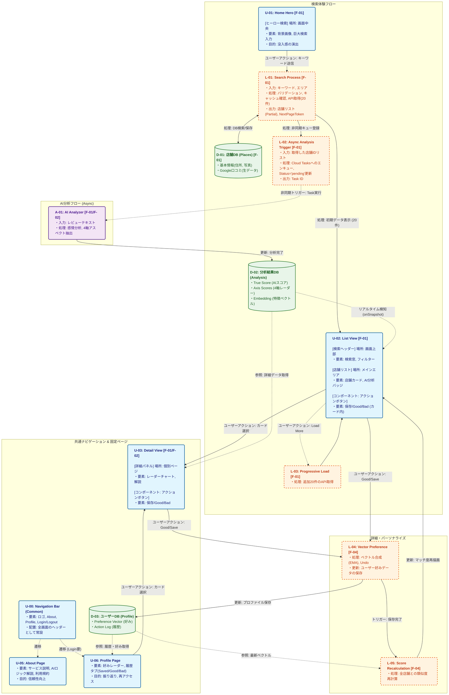

# 目次
- [1. プロジェクト仕様書：AI Concierge for グルメ](#1-プロジェクト仕様書：ai-concierge-for-グルメ)
    - [1-1. アプリケーション定義](#1-1-アプリケーション定義)
    - [1.2. 技術スタック概要](#12-技術スタック概要)
    - [1.3. コスト最適化戦略](#13-コスト最適化戦略)
- [2. F_01_検索&AI分析機能](#2-f_01_検索ai分析機能)
    - [1. コンセプト](#1-コンセプト)
    - [2. 検索・分析ロジック](#2-検索・分析ロジック)
    - [3. 画面・UI設計](#3-画面・ui設計)
- [3. F_02_多軸評価・分析](#3-f_02_多軸評価・分析)
    - [1. コンセプト](#1-コンセプト-1)
    - [2. 分析ロジック (Gemini 1.5 Pro)](#2-分析ロジック-gemini-15-pro)
    - [3. データ構造 (Schema)](#3-データ構造-schema)
- [4. F_03_利用シーン判定](#4-f_03_利用シーン判定)
    - [1. コンセプト](#1-コンセプト-2)
    - [2. ロジック変更 (Filter over Boost)](#2-ロジック変更-filter-over-boost)
    - [3. 画面・UI設計](#3-画面・ui設計-1)
- [5. F_04_グルメノートブック機能](#5-f_04_グルメノートブック機能)
    - [1. コンセプト](#1-コンセプト-3)
    - [2. ユーザーアクション設計](#2-ユーザーアクション設計)
    - [3. 画面・UI設計](#3-画面・ui設計-2)
    - [4. データ構造 (Schema)](#4-データ構造-schema-1)

 

# 1. プロジェクト仕様書：AI Concierge for グルメ

このドキュメントは本プロジェクトの **SSOT (Single Source of Truth)** です。
詳細な設計情報は `docs/` ディレクトリ内の各ドキュメントを参照してください。

## 1-1. アプリケーション定義

本アプリケーションの全機能を以下の**機能定義マトリクス**にて一元管理する。**AARRRモデル**に基づいて、各機能の収益性を考慮する。

| ID | 機能名 (Feature) | What & How (概要・実現ロジック) | Who & Why (ターゲット・心理) | Earning (役割・マネタイズ) |
| :--- | :--- | :--- | :--- | :--- |
| **F-01** | **検索&AI分析機能** (Search & AI Analysis Score) | **What**: 検索結果（エリア、キーワード）に対して、口コミを感情分析して得られたAI客観スコア (0.0-5.0)による比較評価を提供する。 **How**: 検索はPlaces APIのテキストサーチを利用する。Places APIの上位5件レビューとHotPepper情報をプロンプトに注入し、AIが多角的に評価。 | **正確性を求めるユーザー** 「一番良い店に行きたい。総合星スコアだけでは納得感が得られない。」 | **Revenue：集客・データ収集** 無料開放により利用を促進。メインのAIコンシェルジェ機能用のデータ収集 コストは動画広告とアフィリエイトで回収。 |
| **F-02** | **多軸評価・分析** (Multi-Axis Analysis) | **What**: 味・接客・雰囲気・コスパの4軸レーダーチャートとGap分析。各評価軸ごとにPros/Consを表示して透明性を高める。 **How**: レビューテキストからのアスペクト抽出と、Googleスコアとの乖離理由の言語化。 | **こだわり層・慎重派** 「味さえ良ければ接客は問わない。納得感をもって店選びをしたい。」 | **Activation：高品質レビュー体験の提供** 生成AI時代に沿った、品質と透明性の高い客観的AI評価を提供する。パーソナライズ機能のベースにもなる。 |
| **F-03** | **利用シーン判定** (Usage Scenarios) | **What**: デート/接待/一人/家族/団体への適性判定。 **How**: 「静か」「個室」等の文脈解析と設備情報の突合。 | **幹事・計画者** 「恥をかきたくない。失敗したくない。」 | **Activation：利用シーンに合わせたスコア最適化** 利用シーンに合わせたスコア最適化から使いやすさを高める。リピート率を高める。 |
| **F-04** | **グルメノートブック機能** | **What**: 店舗の保存、いいね機能。ノートブック機能を持たせつつ、いいねした店舗に基づてユーザーの傾向分析を行う。パーソナライズされた評価スコアを提供し、おすすめ店舗提案機能へのベースにする。 **How**: いいねした店舗の評価軸ごとのスコア、Embeddingsした内容をそれぞれベクトルで保管する。**Softmax重み付け**（評価軸の傾向）+ **コサイン類似度**（店舗のユーザーのベクトル類似度）を合わせて最終的なおすすめスコアを算出。| **お気に入りを整理・管理したい層** 「気になる店舗を保存したい。保存した店舗は来店したかチェックしたい。」（付加価値として、ノートブック機能に加えて、いいねした店舗に基づいた傾向分析機能を提供。） | **Retention：ロックイン** 育てたデータが資産となり、他サービスへ移行しづらくなる。 **Revenue：サブスクリプション** いいねに基づくスコア計算、おすすめ店舗紹介機能は有料会員機能にする。育てたデータの利用価値を最大化したい心理（ディロド効果）を利用して課金を促す。 |
| **F-05** | **AIコンシェルジュ** | **What**: 対話形式でベストな店を提案する機能。 **How**: 蓄積された全店舗ベクトルとユーザーの傾向ベクトルとのコサイン類似度検索。 | **決断疲れ層・初心者** 「自分で選べない、決めてほしい」 | **Revenue：サブスクリプション** デート先を探したいが不安感がある心理から課金を促す。 |
| **F-06** | **AIランキング機能** | **What**: エリア・ジャンル別にAI評価スコアでランキングを表示する。店舗ごとの全期間・週間・月間の閲覧数をカウントし、上位数%のランキングを表示して変動させる。 **How**: 蓄積された店舗情報のAI評価スコア、エリア・ジャンル情報を使用する | **集客・SEO目的** | **Acquisition：集客・SEO対策** 週間ランキングをSNS発信することで話題性を高める。エリア別のランキングページをSEO用に作成する。 |
| **F-07** | **URLリンク生成機能** | **What**: URLリンクを生成する機能。 **How**: URL駆動のページ遷移を実装する。 | **このサイトで良い店を見つけたユーザー**「リンクを発行して共有したい。」 | **Referral：紹介** 他人への紹介の導線を作りユーザー層を広げる。 |

### 設計要素ID体系 (Design Element IDs)

開発とテストの粒度を揃えるため、各機能IDをさらに「設計要素 (Design Element)」に分解して管理する。これにより、機能の実装漏れを防ぎ、単体テスト/E2Eテストの対象を明確化する。

**サフィックス定義**:
*   `UI` (User Interface): 画面、コンポーネント、状態管理。
*   `Logic` (Business Logic): サーバーアクション、APIハンドラ、計算処理。
*   `DB` (Data Model): スキーマ定義、クエリ、インデックス。
*   `AI` (AI Prompt): プロンプト設計、LLM連携ロジック。

**設計要素分解マトリクス**:

| 機能ID | 設計要素ID | 要素名・詳細 | テスト観点 (Example) |
| :--- | :--- | :--- | :--- |
| **F-01** | **F-01-UI** | **AIスコア表示コンポーネント** リスト/詳細でのスコア表示。 | 表示崩れなし、数値のまるめ処理確認。 |
| (AI分析) | **F-01-Logic** | **信頼性フィルタ・スコア算出** 上位5件フィルタ、重み付け平均算出。 | サクラ除外動作、算出ロジックの正当性。 |
| | **F-01-AI** | **分析プロンプト (Analyzer)** 感情分析、Gap理由抽出プロンプト。 | プロンプト応答のJSON構造妥当性。 |
| **F-02** | **F-02-UI** | **レーダーチャート・Gap表示** 4軸チャート描画、Pros/Consリスト。 | チャート描画ライブラリ動作、レスポンシブ。 |
| (多軸) | **F-02-AI** | **アスペクト抽出ロジック** レビューからの軸別スコアリング処理。 | 各軸スコアの正規化確認。 |
| **F-03** | **F-03-UI** | **シーン適性カード** シーン別スコアと理由コメントの表示。 | スコア順ソート表示の確認。 |
| (シーン) | **F-03-AI** | **シーン適性判定ロジック** 5つの利用シーンへの適性スコアリング。 | 文脈キーワードヒット時の加点確認。 |
| **F-04** | **F-04-UI** | **プロフィール & トグルUI** 「グルメノート画面」の実装し、保存、グッド、バッドした店舗の一覧を表示する。リスト/詳細では、パーソナライズON/OFFスイッチを配置。詳細には各種アクションボタンを配置。 | 状態変化時のUI再レンダリング、楽観的更新。 |
| (個人の書) | **F-04-Logic** | **EMA学習・Softmax重み付け** アクションに応じて店舗JSONデータのEmbeddingと評価軸スコアをもとにユーザーの好みベクトルをEMA平均で計算。 | 計算結果の収束性、外れ値の除外。 |
| | **F-04-DB** | **Userスキーマ拡張** Userスキーマに保存、グッド、バッドした店舗一覧を格納。ユーザーの評価軸ごとの傾向EMA平均と、店舗ベクトルのEMA平均を格納。PlacesスキーマにJSONをEmbeddingしたベクトルを格納。 | Firestore保存データの型整合性。 |
| **F-05** | **F-05-AI** | **AIコンシェルジュ対話** (Future) 対話履歴保持、意図理解。 | コンテキスト維持の確認。 |
| **F-06** | **F-06-UI** | **ランキングウィジェット** TOP3表示、王冠アイコン。 | スクロール時の遅延読み込み。 |
| (Ranking)| **F-06-Logic** | **ランキング集計バッチ** 閲覧数集計、エリア別スコアソート。 | 定期実行(Cron)の動作、ソート順。 |
| **F-07** | **F-07-UI** | **シェアボタン・OGP** クリップボードコピー、SNSシェア。 | 各SNSでのプレビュー表示確認。 |
| (URL) | **F-07-Logic** | **URLステート生成** 絞り込み条件のクエリパラメータ化。 | 復元時の整合性 (Parse/Stringify)。 |

 

### 参考フレームワーク
**AARRRモデル**

ユーザーがサービスを知ってから収益を生むまでのステップを5段階に分解する。どこでユーザーが離脱しているか、どこを改善すれば収益が上がるかを特定するのに最適。
* Acquisition (獲得): ユーザーがサイトやアプリに来る（SEO、SNS）。
* Activation (活性化): ユーザーが初めて価値を感じる（登録、初回利用）。
* Retention (継続): 繰り返し使う。
* Referral (紹介): 他人に勧める。
* Revenue (収益): マネタイズ。 課金や広告閲覧が発生する。

 

## 1.2. 技術スタック概要

詳細は [`docs/architecture.md`](./docs/architecture.md) を参照。

*   **Frontend/Backend**: Next.js 14+ (App Router)
*   **Styling**: Tailwind CSS + Lucide React
*   **Database**: Google Cloud Firestore (Cache & Analysis storage)
*   **AI**: Vertex AI (Gemini 2.0 Flash)
*   **Infrastructure**: Google Cloud Run + Cloud Tasks

 

## 1.3. コスト最適化戦略

**ID先行取得による検索コスト削減**
Google Places APIのコストを最小化するため、以下の検索フローを採用する。

1.  **ID検索 (Free)**: まず `Text Search (ID Only)` を実行し、Place IDのリストのみを取得する（コスト: $0）。
2.  **キャッシュ判定**: 取得したIDリストに対し、Firestore上のキャッシュ有効性を確認する。
3.  **条件付きデータ取得**:
    *   **全員キャッシュあり**: Firestoreのデータを返却（コスト: $0）。
    *   **欠損あり**: 欠損がある場合のみ、元の検索クエリで `Text Search (Pro)` を実行し、全件の最新データを取得・保存する（コスト: 通常通り）。

これにより、2回目以降の検索（キャッシュヒット時）のAPIコストを完全にゼロにする。

 
 

# 2. F_01_検索&AI分析機能

## 1. コンセプト
**「星の数より、真実のスコアを。」**
Googleマップの星評価（4.0など）は「サクラ」や「依頼レビュー」、「期待値のズレ」によって汚染されていることが多い。
AIがレビュー本文を読み解くことで、これらのノイズを排除し、**「その店の実力値（True Score）」**を再計算して提示する。

## 2. 実装詳細

### UI Layer
*   **ヒーローサーチコンポーネント**: トップページ中央に配置。没入感のある背景画像。
*   **リスト表示 (PlaceList)**:
    *   **非ブロッキング検索**: 検索開始時に即座にリスト画面へ遷移。プレースホルダーを表示しつつ、バックグラウンドデータ取得を行う。
    *   **Progressive Loading**: 最初の20件を取得・表示した後、自動的に次の20件を取得する。
    *   **状態表示**:「検索中...」等のステータスをリスト内にインライン表示。
*   **リスト表示 (PlaceList)**:
    *   **AIスコア（星）**: 金色の星で大きく表示。Google元スコアは小さく併記。
    *   **スケルトンローディング**: `status: pending` の店はポーリングで完了次第表示。

### Logic Layer
*   **ハイブリッド検索フロー**:
    1.  **Client Cache**: 同一クエリならメモリ(`SearchContext`)から即時表示。
    2.  **Server Cache**: FirestoreキャッシュがあればAPI課金回避。
    3.  **Progressive Loading**: 初回20件取得で即時表示し、裏で追加20件を取得する並列処理フロー。
    4.  **Async Analysis**: 検索結果取得はServerAction(同期)、AI分析はCloud Tasks(非同期)で分離しレスポンスを高速化。
*   **True Score算出**: `(平均 * 信頼度 * 新鮮度)` で重み付け計算。

### AI Layer
*   **Gemini 2.0 Flash**:
    *   レビューの感情分析（ポジネガ判定）。
    *   サクラ/スパム検知（定型文の除外）。

### DB Layer (Firestore)
*   **places/{placeId}**:
    *   `originalRating`: Googleスコア。
    *   `trueScore`: AI算出スコア。
    *   `status`: 'pending' | 'completed' | 'error'。

 

# 3. F_02_多軸評価・分析

## 1. コンセプト
**「"美味しい" だけでは、店は選べない。」**
「味」「接客」「雰囲気」「コスパ」の4次元で構造化して評価する。

## 2. 実装詳細

### UI Layer
*   **レーダーチャート (UserPreferenceRadar)**:
    *   4軸のスコアを正規化して描画。
    *   値が低い項目も相対的に見やすく調整。
*   **Gap Analysis表示**: Googleスコアとの乖離理由を表示。
*   **Pros/Consリスト**: 各軸の良い点・悪い点を箇条書き表示。

### Logic Layer
*   **スコア正規化**: 0.0-5.0のレンジにマッピング。
*   **相対評価**: ユーザーの重視点に合わせて、最大値を100%とする正規化ロジック。

### AI Layer
*   **アスペクトベース感情分析 (ABSA)**:
    *   レビュー文から「味」「接客」等のアスペクトを抽出・評価。
*   **Gap理由生成**: 数値の乖離原因を言語化。

### DB Layer
*   **places/{placeId}/axisScores**:
    *   `taste`, `service`, `atmosphere`, `cost`: number.
*   **places/{placeId}/gapReason**: text.

 

# 4. F_03_利用シーン判定

## 1. コンセプト
**「TPOを外さない、鉄壁のフィルタリング。」**
利用シーン（デート、接待など）に対する適性判定を行う。

## 2. 実装詳細

### UI Layer
*   **シーンバッジ表示**: 適性スコア4.0以上のシーンをカードに明示。
*   **グローバルフィルター**: 選択したシーンに合致する店舗のみに絞り込み。

### Logic Layer
*   **Filter over Boost**:
    *   加点ではなく「絞り込み」として機能。
    *   **OR条件**: 複数選択時は「いずれかが4.0以上」でヒット。

### AI Layer
*   **文脈解析**:
    *   「静か」「個室」→ Business
    *   「夜景」「カップル」→ Date
    *   設備情報とレビュー内容の突合。

### DB Layer
*   **places/{placeId}/usageScores**:
    *   `business`, `date`, `solo`, `family`, `group`: 0.0-5.0。

 

# 5. F_04_グルメノートブック機能

## 1. コンセプト
**「基本は使いやすい備忘録。使うほどにAIが好みを理解する。」**
保存・評価アクションを通じてユーザーの好みを学習し、パーソナライズする。

## 2. 実装詳細

### UI Layer
*   **アクションボタン**: リスト/詳細に「保存」「Good」「Bad」を配置。楽観的UIで即時反応。
*   **マイページ (/profile)**:
    *   保存・Good・Badのタブ切り替えリスト。
    *   **傾向レーダー**: 自分の好みを可視化。
*   **並び替え**: 「マッチ度順」でのソート機能。

### Logic Layer
*   **ベクトル学習 (EMA)**:
    *   Good: ユーザーベクトルを店舗ベクトルへ近づける ($+0.2$).
    *   Bad: 遠ざける ($-0.5$).
    *   Undo: 完全なロールバック。
*   **ハイブリッドスコア算出**:
    *   $S_{final} = 0.4 \times S_{quality} + 0.6 \times S_{match}$。

### AI Layer
*   **Embedding (Vertex AI)**:
    *   店舗情報のテキスト化 (`Name + Genre + Summary...`) → 768次元ベクトル化。
*   **コサイン類似度**: ユーザーベクトルと店舗ベクトルの相性計算。

### DB Layer
*   **users/{uid}**:
    *   `preferenceVector`: 現在の好みベクトル。
    *   `aiPreferences`: 評価軸ごとの重み。
*   **users/{uid}/interactions**:
    *   評価履歴ログ（Undo用）。

 

# 6. 詳細設計: インタラクションフロー (Detailed Interaction Flow)

基本設計ID (F-xx) と紐づいた、UI/Logic/AI/DBの詳細な連携図。

### ID体系
*   **U-xx**: **UI** (Screen / Component)
*   **L-xx**: **Logic** (Server Action / Internal Logic)
*   **A-xx**: **AI** (LLM / Analysis)
*   **D-xx**: **DB** (Database / Storage)

。
*   **コサイン類似度**: ユーザーベクトルと店舗ベクトルの相性計算。

### DB Layer
*   **users/{uid}**:
    *   `preferenceVector`: 現在の好みベクトル。
    *   `aiPreferences`: 評価軸ごとの重み。
*   **users/{uid}/interactions**:
    *   評価履歴ログ（Undo用）。
