# 1. プロジェクト仕様書：AI Concierge for グルメ

## 1.1. はじめに
本アプリケーションは、Googleマップの口コミデータをAIを用いて分析し、ユーザーの価値観に合わせて店舗を提案するコンシェルジュアプリケーションです。
この章では、アプリケーションの概要を説明します。

<br>

## 1.2. 技術スタック概要

詳細は [`docs/architecture.md`](./docs/architecture.md) を参照。

*   **Frontend/Backend**: Next.js 14+ (App Router / Server Components)
*   **Styling**: Tailwind CSS + Lucide React
*   **Database**: Google Cloud Firestore (Cache & Analysis storage)
*   **AI**: Vertex AI (Gemini 2.0 Flash)
*   **Infrastructure**: Google Cloud Run + Cloud Tasks

<br>

## 1.3. マネタイズ戦略
**AARRRモデル** を満たすようシステム機能を設計する。
収益は主に動画広告収入、アフィリエイト、サブスクリプションを想定する。

**参考：AARRRモデル**

ユーザーがサービスを知ってから収益を生むまでのステップを5段階に分解する。どこでユーザーが離脱しているか、どこを改善すれば収益が上がるかを特定するのに最適。
* Acquisition (獲得): ユーザーがサイトやアプリに来る（SEO、SNS）。
* Activation (活性化): ユーザーが初めて価値を感じる（登録、初回利用）。
* Retention (継続): 繰り返し使う。
* Referral (紹介): 他人に勧める。
* Revenue (収益): マネタイズ。 課金や広告閲覧が発生する。

<br>

## 1.4. デザインガイドライン (Design Guidelines)

### 配色設計 (Color Scheme)
ブランドイメージである「高級感」「温かみ」「食欲」を表現するため、以下の配色ルールを厳守する。

**1. Primary Brand Color**
*   **Color Code**: `#E65100` (Material Orange 900)
*   **名称**: Burnt Orange / Brand Orange
*   **用途**:
    *   サイト全体のキーカラー
    *   Primary Action Button (AI比較ボタン等)
    *   強調アイコン (王冠、No.1バッジ)
    *   ヘッダー等のアクセントボーダー
*   `src/app/globals.css` にて `--color-brand` として定義済。


**2. Base Colors**
*   **見出しテキスト**: `#3E3E3E` (淡めの黒)
    *   `src/app/globals.css` にて `--color-brand-black` として定義済。
*   **本文テキスト**: `brand-black/80`
*   **補足テキスト**: `brand-black/50`
*   **枠線**: `brand-gray`
*   **背景**: `brand-gray-light`
    *   純白(`FFFFFF`)のカードを目立たせるため、ベース背景にはごく薄いグレーを使用する。

**3. Functional Colors (Evaluation Axes)**
詳細分析および比較表では、各評価軸を直感的に識別するため固定色を使用する。
*   **味**: `rose-500` (Dish / Rose)
*   **接客**: `pink-500` (Service / Pink) - ハートフルな印象
*   **雰囲気**: `amber-500` (Atmosphere / Amber) - 煌びやかさ
*   **コスパ**: `emerald-500` (Cost / Emerald) - お得感・プラス収支


**4. Implementation Note**
*   Tailwind v4 導入に伴い、`globals.css` での変数定義（`--color-brand` 等）を活用し、ハードコードを減らす方針とする。

<br>
<br>

# 2. 基本設計：ユーザーシナリオ別インタラクションフロー定義

## 2.1. はじめに
この章では、ユーザーシナリオをベースにして、システムのインタラクションフローを定義します。<br/>
 
**インタラクションフローの凡例**
*   青色: User Interface
*   黄緑色: Component
*   赤色: Logic
*   紫色: AI
*   緑色: Database
*   灰色: Start/End
*   **共通ステート定義**:
    *   **Loading**: スケルトンスクリーンまたはスピナーを表示し、操作をブロックする（Disable）。
    *   **Error**: Toast通知（一時的エラー）またはAlert表示（永続的エラー/Empty State）を行う。
    *   **Empty**: "No Data" などのプレースホルダーを表示する。


<br>

## 2.2. 設計要素一覧

各コンポーネントの実装状況と処理内容の定義です。

### User Interface (U-xx)
| ID | 名前 | Status | File / Component | 詳細 (Trigger + IPO) |
| :--- | :--- | :--- | :--- | :--- |
| **U-01** | **Home Hero** | **Implemented** | `src/components/home/HeroSection.tsx`<br>`src/components/home/ServiceBenefits.tsx` | **Trigger**: アクセス / ホームリセット<br>**Process**: 背景画像と検索窓(`SearchInput`)、サービスの価値提案を表示。<br>**Output**: ヒーローセクション描画。<br>**Validation**: 検索語句は1〜100文字。空文字入力時はボタン無効化。
| **U-02** | **App Shell** | **Implemented** | `src/app/page.tsx` (Server)<br>`src/components/ClientHomeWrapper.tsx` (Client) | **Trigger**: ルートアクセス<br>**Process**: Server側で初期データ(`searchPlaces`, `getPlaceDetails`)を取得し、`ClientHomeWrapper`へ渡す。SEOメタデータ生成も行う。<br>**Output**: 初期HTML + クライアントアプリケーション。 |
| **U-03** | **List View** | **Implemented** | `src/components/places/PlaceListView.tsx` | **Trigger**: `view=LIST`<br>**Process**: 検索バー、Stickyフィルター(U-12)、店舗リスト(PlaceList)を表示。<br>**Output**: 検索結果画面。<br>**State**: Loading(Skeleton x 5), Error(Toast), Empty(Illustration).
| **U-04** | **Detail View** | **Implemented** | `src/components/places/PlaceDetailView.tsx` | **Trigger**: `view=DETAIL`<br>**Process**: 詳細ナビゲーション、詳細分析(AnalysisResult)を表示。<br>**Output**: 詳細分析画面。 |
| **U-05** | **Comparison Tray** | **Implemented** | `src/components/ComparisonTray.tsx` | **Trigger**: 複数店舗の選択<br>**Process**: 画面下部に比較候補をストックし表示する。<br>**Output**: 比較トレイUI。 |
| **U-06** | **Verdict Modal** | **Implemented** | `src/components/VerdictModal.tsx` | **Trigger**: 比較実行ボタン<br>**Process**: AI判定結果(Winner/Loser)を表示する。<br>**Output**: 判定モーダル。 |
| **U-07** | **Profile View** | **Implemented** | `src/app/profile/page.tsx`<br>`PlaceListItem.tsx` | **Trigger**: `/profile`遷移<br>**Process**: Interaction履歴取得、タブ切り替え、リスト表示。<br>**Output**: マイページ表示。 |
| **U-08** | **Memo Modal** | **Implemented** | `src/components/MemoModal.tsx` | **Trigger**: U-07の鉛筆ボタン<br>**Process**: `<dialog>`で最前面表示。メモ・タグ入力。<br>**Output**: メモ入力ダイアログ。<br>**Constraint**: Memo max 500 chars (絵文字可). Tags max 5 items.
| **U-09** | **Preference Filter** | **Implemented** | `src/components/PreferenceFilter.tsx` | **Trigger**: 常時(Sticky)<br>**Process**: 4軸トグル、シーン選択、AIタグ選択、自動/手動モード切替を内包するアコーディオン。<br>**Output**: フィルタUI。 |
| **U-10** | **Tag Management** | **Implemented** | `src/app/settings/tags/page.tsx` | **Trigger**: プロフィールメニュー<br>**Process**: AIタグの一覧表示、作成、削除。<br>**Output**: タグ設定画面。 |
| **U-11** | **Feedback Popup** | **Implemented** | `src/components/LearningFeedbackPopup.tsx` | **Trigger**: タグ決定後 (未選択含む)<br>**Process**: 学習結果と**AI習熟度(XP)**の可視化。<br>- Generic: Global傾向を表示。<br>- Tagged: Global vs Tagの比較レーダーを表示。<br>- **Proficiency**: Global/Tag XPバーを表示。<br>**Output**: フィードバックアニメーション (Duration: 3000ms, Auto-Close).
| **U-12** | **Pricing Modal** | <span style="color:red">Pending</span> | - | **Trigger**: プレミアム機能アクセス<br>**Process**: プラン比較表と購入ボタン(Stripe Link)を表示。<br>**Output**: 課金誘導モーダル。 |
| **U-13** | **Video Ad** | <span style="color:red">Pending</span> | - | **Trigger**: 無料制限到達<br>**Process**: 動画広告を再生し、完了までブロックする。<br>**Output**: 動画プレーヤー。 |
| **U-14** | **Ranking Page** | **Implemented** | `src/app/rankings/[...slug]/page.tsx` | **Trigger**: SEOランディング/Directory遷移<br>**Process**: エリアxシーン別の静的ランキングを表示 (ISR)。<br>**Output**: ランキングLP。<br>**Validation**: URLパラメータのAllowlist照合必須。 |
| **U-15** | **Footer Links** | **Implemented** | `src/components/Footer.tsx` | **Trigger**: フッター表示<br>**Process**: 「エリア一覧」への単一リンクのみを表示。<br>**Output**: シンプルなフッター。 |
| **U-16** | **Directory Page** | **Implemented** | `src/app/rankings/[prefecture]/page.tsx` | **Trigger**: エリア一覧より遷移<br>**Process**: 都道府県内の全市区町村・シーンへのリンク一覧を表示する。<br>**Output**: ディレクトリページ(Pref)。 |
| **U-17** | **Hub Page** | <span style="color:red">Pending</span> | `src/app/rankings/page.tsx` | **Trigger**: フッター/検索流入<br>**Process**: 全国47都道府県を地方別に網羅したリンク集。<br>**Output**: ディレクトリハブ(Nationwide)。 |
| **U-18** | **Global Header** | **Implemented** | `src/components/Header.tsx` | **Trigger**: 全ページ(LP/Ranking)<br>**Process**: 共通ナビゲーション、ログイン状態表示、トップ戻りリンク。<br>**Output**: 共通ヘッダー。 |
| **U-19** | **SEO Controller** | **Implemented** | `src/app/page.tsx`<br>`src/components/seo/JsonLd.tsx` | **Trigger**: ページロード<br>**Process**: 動的Metadata生成と、Schema.org準拠のJSON-LD (`WebSite`, `ItemList`, `Restaurant`) を出力。<br>**Output**: `<head>` タグ内メタデータ。 |

### Logic (L-xx) & Hooks
| ID | 名前 | Status | File / Method | 詳細 (Trigger + IPO) |
| :--- | :--- | :--- | :--- | :--- |
| **H-01** | **Filter Logic** | **Implemented** | `src/hooks/useFilterParams.ts` | **Trigger**: フィルタUI操作<br>**Process**: `focus`, `scenes`, `tags` のURLパラメータとReact Stateを双方向同期。<br>**Output**: `focusedAxes` 等の状態と `handleToggle` 関数。 |
| **H-02** | **Score Logic** | **Implemented** | `src/hooks/usePersonalizedScores.ts` | **Trigger**: 検索結果更新 or フィルタ変更<br>**Process**: `getPersonalizedScores` (L-03) を呼び出し、スコアと `effectivePrefs` (L-08) を管理。<br>**Output**: `pScores` (Map), `effectivePrefs`。 |
| **H-03** | **Sort Logic** | **Implemented** | `src/hooks/usePlaceSorter.ts` | **Trigger**: `pScores` 更新 or ソート順変更<br>**Process**: リアルタイムデータ統合と、AIスコア/Google評価に基づくソート。<br>**Output**: `sortedPlaces`。 |
| **H-04** | **Realtime Places** | **Implemented** | `src/hooks/useRealtimePlaces.ts` | **Trigger**: `places` IDリスト変更<br>**Process**: Firestoreの`places`コレクションをリアルタイム監視(onSnapshot)し、データ更新を検知。<br>**Output**: `realtimePlaces` (Map)。 |
| **H-05** | **Interactions Hook** | **Implemented** | `src/hooks/useUserInteractions.ts` | **Trigger**: プロフィール画面など<br>**Process**: ユーザーの全インタラクション履歴を取得。<br>**Output**: `interactions`。 |
| **H-06** | **Status Hook** | **Implemented** | `src/hooks/useUserInteractionStatus.ts` | **Trigger**: 各店舗カード表示<br>**Process**: 特定店舗に対する自分のアクション状態(`isSaved`, `isVisited`など)を取得。<br>**Output**: `status` オブジェクト。 |
| **L-01** | **Search Process** | **Implemented** | `src/server/actions/place.ts`<br>`searchPlaces` | **Trigger**: 検索実行<br>**Input**: `query` (String)<br>**Process**: コスト最適化フロー。<br>1. TextSearch(Full)で20件一括取得。<br>2. DBキャッシュ照合(分析済確認)。<br>3. 新規・期限切れのみ分析キューへ追加。<br>**Output**: `Place[]` (Unified Schema) |
| **L-02** | **Async Analysis** | **Implemented** | `src/server/actions/place.ts`<br>`enqueueAnalysis` | **Trigger**: 検索/詳細取得時 (Status!=completed)<br>**Input**: `placeId`<br>**Process**: Cloud Tasksへ分析タスクをエンキュー。<br>**Output**: Void (Fire-and-forget) |
| **L-03** | **Re-ranking** | **Implemented** | `src/server/actions/personalize.ts` (Controller)<br>`src/server/services/scoring.ts` (Logic) | **Trigger**: リスト表示・更新時 (H-02)<br>**Input**: `placeIds`, `uid`, `scenarioIds`, `mode`<br>**Process**: **Scenario-Based Blended Scoring**。<br>Global好みとTagごとの好みをブレンドし、`effectivePreferences` を算出。<br>**Output**: `PScore[]` (w/ `effectivePreferences`) |
| **L-06** | **Compare Logic** | **Implemented** | `src/server/actions/comparison.ts` (Controller) | **Trigger**: 比較実行<br**Input**: `placeIds`, `uid`, `scenarioIds`<br>**Process**: L-03同様のブレンドベクトルを作成し、Cos類似度でランク付け。Pros/Cons抽出。<br>**Output**: `ComparisonResult` (Winner, Matrix) |
| **L-09** | **Update Status** | **Implemented** | `src/server/actions/user.ts`<br>`submitEvaluation` | **Trigger**: 来店済チェック<br>**Input**: `uid`, `placeId`, `evaluation` (null if just visited)<br>**Process**: `submitEvaluation` が `isVisited: true` を更新する。<br>**Output**: Void |
| **L-10** | **Learning Logic** | **Implemented** | `src/server/actions/user.ts`<br>`submitEvaluation` | **Trigger**: Good/Bad評価/タグ選択<br>**Input**: `uid`, `placeId`, `evaluation`, `scenarioIds`<br>**Process**: <br>1. 前回評価のUndo。<br>2. 新評価のApply (Global & Scenarios)。<br>3. `blendPreferences` による `effectivePreferences` の算出。<br>4. **Proficiency XP Increment** (Global/Tag)。<br>**Output**: `preferences`, `experience`, `effectivePreferences` |
| **L-16** | **Routing Validator** | **Implemented** | `src/utils/seo-helpers.ts`<br>`validateRankingParams` | **Trigger**: Ranking/Directoryアクセス<br>**Input**: `pref` (optional `city`, `scene`)<br>**Process**: Allowlist(seo-areas.ts)と照合し、不正ならfalseを返す(404トリガー)。<br>**Output**: Boolean |
| **L-17** | **Ranking Fetch DB** | **Implemented** | `src/server/actions/ranking.ts`<br>`getRankingPlaces` | **Trigger**: RankingPageデータ取得<br>**Input**: `pref`, `city`, `scene`<br>**Process**: Array-Containsで検索後、**重み付けスコア(Manual Mode)**を計算しソートする。<br>**Output**: `Place[]` |
| **L-18** | **Batch Aggregation** | <span style="color:red">Pending</span> | `src/app/api/cron/stats/route.ts` | **Trigger**: Cloud Scheduler (Daily)<br>**Input**: All Places<br>**Process**: 全店舗のスコア(>=4.0)を集計し、D-07へ保存。<br>**Output**: JSON Response |
| **L-19** | **Stats Logics** | <span style="color:red">Pending</span> | `src/server/actions/ranking.ts`<br>`getPrefectureStats` | **Trigger**: Directory Page表示 (U-16)<br>**Input**: `pref`<br>**Process**: D-07から集計結果を読み込む。<br>**Output**: `Set<string>` (Valid Keys) |

### Database (D-xx)
| ID | 名前 | Status | Collection / Path | 概要 |
| :--- | :--- | :--- | :--- | :--- |
| **D-01** | **Places DB** | **Implemented** | `places/{placeId}` | 店舗基本情報＋AI分析結果。 |
| **D-02** | **User Profile** | **Implemented** | `users/{uid}` | ユーザー基本情報＋嗜好ベクトル。 |
| **D-03** | **Analysis** | **Implemented** | `places/{placeId}` | (D-01内包) 感情分析・4軸スコア・特徴量。 |
| **D-04** | **Interactions** | **Implemented** | `users/{uid}/interactions/{placeId}` | ユーザー行動履歴(Save, Good/Bad)と学習ログ。 |
| **D-05** | **Customers** | <span style="color:red">Pending</span> | `customers/{uid}` | Stripe連携用の決済・契約情報。 |
| **D-06** | **User Scenarios** | **Implemented** | `users/{uid}/scenarios/{scenarioId}` | ユーザー作成のカスタムシーン(ベクトルなど)を保存するサブコレクション。 |
| **D-07** | **Prefecture Stats** | <span style="color:red">Pending</span> | `prefecture_stats/{prefecture}` | バッチ集計されたSEO用リンクカウント情報。 |
| **D-07** | **Prefecture Stats** | <span style="color:red">Pending</span> | `prefecture_stats/{prefecture}` | バッチ集計されたSEO用リンクカウント情報。 |

#### Schema Details

**D-01 / D-03: Places Collection (`places/{placeId}`)**
> [!NOTE]
> **Data Type Mapping**: Frontend uses standard JS `Date` objects, while Firestore uses `Timestamp`. Converters are placed in `src/utils/firebase/converters.ts`.
> `createdAt` and `updatedAt` are managed by Server Actions to ensure server time consistency.

```typescript
interface Place {
  id: string;             // Google Place ID
  name: string;           // 店舗名
  location: { lat: number; lng: number };
  nearestStation?: string;

  // AI Analysis (D-03)
  status: 'pending' | 'processing' | 'completed' | 'error';
  summary?: string[];       // AI要約（リスト形式）
  axisScores?: {          // 4軸スコア (0-5)
    taste: number; service: number; atmosphere: number; cost: number;
  };
  usageScores?: {         // シーン適性 (0-5)
    date: number; solo: number; business: number; family: number; group: number;
  };
  embeddingVector?: number[]; // Vertex AI Embedding (768-dim)

  // External Data
  hotpepper?: HotPepperData; // ホットペッパー連携データ
  originalRating: number;   // Google Rating
  userRatingsTotal: number;
  priceLevel?: string;    // PRICE_LEVEL_MODERATE etc.
  address?: string;       // Formatted Address
  
  updatedAt: Timestamp;
}
```

**D-02: Users Collection (`users/{uid}`)**
```typescript
interface UserProfile {
  uid: string;
  displayName: string;
  email: string;

  // Personalization Core
  preferenceVector?: number[]; // ユーザーの「好み」を表すベクトル (EMA更新)
  aiPreferences: {             // 4軸の重視度重み (Linear更新)
    taste: number; service: number; atmosphere: number; cost: number;
  };

  // Explicit Settings
  favoriteAreas: string[];     // ["Shinjuku", "Ginza"]
  favoriteGenres: string[];    // ["Sushi", "Italian"]
  
  // AI Proficiency (F-07)
  experience: number;          // Global Experience (Total XP)
  // Level = floor(experience / 100) + 1
}
```

**D-06: User Scenarios Subcollection (`users/{uid}/scenarios/{scenarioId}`)**
```typescript
interface UserScenario {
  id: string;
  name: string;
  isCustom: boolean;        // true: User Created, false: Default
  
  // Scenario Context
  aiPreferences: { ... };   // Tag Context Preference
  preferenceVector: number[]; // Tag Context Vector

  // Tag Proficiency (F-07)
  experience: number;       // Tag Experience
  // Level = floor(experience / 100) + 1
}
```

**D-04: Interactions Subcollection (`users/{uid}/interactions/{placeId}`)**
```typescript
interface UserInteraction {
  placeId: string;
  uid: string;

  // Flags
  isSaved: boolean;    // 保存状態
  isVisited: boolean;  // 来店記録

  // Visited Memo (Added 2026/01)
  memo?: string;       // 自由記述メモ
  repeat?: 'yes' | 'no' | 'maybe'; // リピート意向タグ

  // Evaluation (Learning Log)
  evaluation?: {
    type: 'good' | 'bad';
    timestamp: Timestamp;
    // どの軸/特徴が要因だったか
    selectedFeatureKeys: string[]; 
    axisImpact?: { taste: number; ... }; // Undo用のDelta記録
  };
  updatedAt: Timestamp;
}
```

#### Schema Details (D-07 Added)
**D-07: Prefecture Stats Collection (`prefecture_stats/{prefecture}`)**
```typescript
interface PrefectureStats {
  prefecture: string; // e.g. "tokyo"
  stats: {
    [key: string]: number; // "shinjuku:date" => 15
  };
  updatedAt: Timestamp;
}
```

**D-07: Prefecture Stats Collection (`prefecture_stats/{prefecture}`)**
```typescript
interface PrefectureStats {
  prefecture: string; // e.g. "tokyo"
  stats: {
    [key: string]: number; // "shinjuku:date" => 15
  };
  updatedAt: Timestamp;
}
```

<br/>

## 2.3. ユーザーシナリオ (Detailed Specifications)

### シナリオ1: 店舗を手動検索して評価する

#### 1. User Story
正確性を求めるユーザーが、具体的なニーズ（例：「表参道 イタリアン」）で検索を行い、AI分析結果（4軸スコア）を参照して、自分の重視する価値観（例：「雰囲気」）でリストを並び替え、最適な店舗を決定する。

#### 2. Interaction Flow (Mermaid)


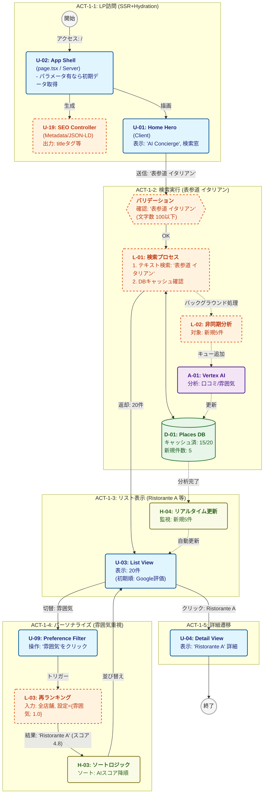
```mermaid
flowchart TD
    %% Define Classes
    classDef ui fill:#e1f5fe,stroke:#01579b,stroke-width:2px,rx:5,ry:5,color:#1a237e,text-align:left
    classDef comp fill:#f9fbe7,stroke:#827717,stroke-width:2px,rx:5,ry:5,color:#33691e,text-align:left
    classDef logic fill:#fff3e0,stroke:#e65100,stroke-width:2px,stroke-dasharray: 5 5,rx:5,ry:5,color:#bf360c,text-align:left
    classDef ai fill:#f3e5f5,stroke:#4a148c,stroke-width:2px,rx:5,ry:5,color:#4a148c,text-align:left
    classDef db fill:#e8f5e9,stroke:#2e7d32,stroke-width:2px,rx:0,ry:0,color:#1b5e20,text-align:left
    classDef startend fill:#f5f5f5,stroke:#9e9e9e,stroke-width:2px,rx:50,ry:50,color:#212121

    S1_Start((開始)):::startend
    S1_End((終了)):::startend

    subgraph ACT_1_1 ["ACT-1-1: LP訪問 (SSR+Hydration)"]
        U_02["<b>U-02: App Shell</b><br/>(page.tsx / Server)<br/>- パラメータ有なら初期データ取得"]:::ui
        U_SEO["<b>U-19: SEO Controller</b><br/>(Metadata/JSON-LD)<br/>出力: titleタグ等"]:::logic
        U_01["<b>U-01: Home Hero</b><br/>(Client)<br/>表示: 'AI Concierge', 検索窓"]:::ui
        
        S1_Start -- "アクセス: /" --> U_02
        U_02 -- "生成" --> U_SEO
        U_02 -- "描画" --> U_01
    end

    subgraph ACT_1_2 ["ACT-1-2: 検索実行 (表参道 イタリアン)"]
        L_Valid{{"<b>バリデーション</b><br/>確認: '表参道 イタリアン'<br>(文字数 100以下)"}}:::logic
        L_01["<b>L-01: 検索プロセス</b><br/>1. テキスト検索: '表参道 イタリアン'<br/>2. DBキャッシュ確認"]:::logic
        D_01[("<b>D-01: Places DB</b><br/>キャッシュ済: 15/20<br/>新規件数: 5")]:::db
        L_02["<b>L-02: 非同期分析</b><br/>対象: 新規5件"]:::logic
        A_01["<b>A-01: Vertex AI</b><br/>分析: 口コミ/雰囲気"]:::ai
        
        U_01 -- "送信: '表参道 イタリアン'" --> L_Valid
        L_Valid -- "OK" --> L_01
        L_01 <--> D_01
        L_01 -. "バックグラウンド処理" .-> L_02
        L_02 -. "キュー追加" .-> A_01
        A_01 -. "更新" .-> D_01
    end

    subgraph ACT_1_3 ["ACT-1-3: リスト表示 (Ristorante A 等)"]
        U_03["<b>U-03: List View</b><br/>表示: 20件<br/>(初期順: Google評価)"]:::ui
        H_04["<b>H-04: リアルタイム更新</b><br/>監視: 新規5件"]:::comp

        L_01 -- "返却: 20件" --> U_03
        D_01 -. "分析完了" .-> H_04
        H_04 -. "自動更新" .-> U_03
    end

    subgraph ACT_1_4 ["ACT-1-4: パーソナライズ (雰囲気重視)"]
        U_09["<b>U-09: Preference Filter</b><br/>操作: '雰囲気'をクリック"]:::ui
        L_03["<b>L-03: 再ランキング</b><br/>入力: 全店舗, 設定={雰囲気: 1.0}"]:::logic
        H_03["<b>H-03: ソートロジック</b><br/>ソート: AIスコア降順"]:::comp

        U_03 -- "切替: 雰囲気" --> U_09
        U_09 -- "トリガー" --> L_03
        L_03 -- "結果: 'Ristorante A' (スコア 4.8)" --> H_03
        H_03 -- "並び替え" --> U_03
    end

    subgraph ACT_1_5 ["ACT-1-5: 詳細遷移"]
        U_04["<b>U-04: Detail View</b><br/>表示: 'Ristorante A' 詳細"]:::ui
    end

    U_03 -- "クリック: Ristorante A" --> U_04
    U_04 --> S1_End
```

#### 3. Test Data Fixtures (Prerequisites)

| Fixture ID | Description | Content Summary | Usage |
|:---|:---|:---|:---|
| **FIX-S1-01** | **Search Results** | エリア「表参道」、ジャンル「イタリアン」の店舗20件。<br>- **Place A**: Atmosphere=4.8, Taste=3.0 (Image: `place_a.jpg`)<br>- **Place B**: Atmosphere=3.5, Taste=4.5 | API `/api/places/search` のレスポンス。<br>VRT用の画像データも固定化する。 |
| **FIX-S1-02** | **Place Detail** | **Place A** の詳細情報。<br>- Name: "Ristorante A"<br>- Summary: "静かな個室あり" | API `/api/places/{id}` のレスポンス。 |

#### 4. Behavior Specifications (Testable)

**Best Practice Note**:
UI品質を担保するため、機能的なアサーション(`toHaveText`)に加え、**Visual Regression Testing (VRT)** を併用します。
Playwrightの `expect(page).toHaveScreenshot()` を使用し、デザインデータと実装のピクセルレベルの差異を検知します。

**Interaction Steps (Positive Flow):**

| Step ID | Actor | Action (When) | System Behavior (Then - UI) | Component Ref. | Acceptance Criteria (Functional) | Visual Criteria (VRT / Style) |
|:---|:---|:---|:---|:---|:---|:---|
| **S1-01** | User | トップページ (`/`) にアクセス | ヒーローセクション(`U-01`)が表示される。<br>ブランドカラーが正しく適用されている。<br>フォーカスは検索窓にはない（a11y）。 | `HeroSection` | `expect(page).toHaveTitle(/AI Concierge/)` | `expect(hero).toHaveScreenshot('S1-01-hero.png')`<br>`// Verify Brand Orange`<br>`expect(hero).toHaveCSS('background-color', 'rgb(230, 81, 0)')`<br>`// A11y Check`<br>`await expect(page).toHaveNoViolations()` |
| **S1-02** | User | 検索語句「表参道 イタリアン」を入力 | 入力内容が反映される。<br>ボタン(`SearchButton`)が活性化し、ホバー時のスタイルが適用される。 | `SearchInput`<br>`(U-01)` | `expect(input).toHaveValue("表参道 イタリアン")`<br>`expect(btn).toBeEnabled()` | `expect(form).toHaveScreenshot('S1-02-form-filled.png')`<br>`// Interactive State`<br>`await btn.hover()`<br>`expect(btn).toHaveCSS('opacity', '0.9')` |
| **S1-03** | User | 送信ボタンをクリック | **Request**: API `POST /search` が `query="表参道..."` で呼ばれる。<br>**Loading**: スケルトンローダーが表示される(UX担保)。<br>**Complete**: リスト(`U-03`)に `FIX-S1-01` の20件が表示される。 | `PlaceListView`<br>`(U-03)` | `const request = await page.waitForRequest('/api/places/search')`<br>`expect(request.postDataJSON().query).toBe("表参道 イタリアン")`<br>`await expect(page.getByText("20件")).toBeVisible()` | **Loading State**:<br>`expect(skeleton).toHaveScreenshot('S1-03-loading.png')`<br>**Complete State**:<br>`expect(listSection).toHaveScreenshot('S1-03-list.png')` |
| **S1-04** | User | フィルタ「雰囲気」(`U-09`)をクリック | 「雰囲気」トグルがActiveスタイル(Amber-500)になる。<br>レーダーチャートの形状が変化する。<br>リストが並び替えられ、**Place A** (Atmo=4.8) が1位に来る。 | `PreferenceFilter`<br>`(U-09)` | `expect(atmoBtn).toHaveAttribute("aria-pressed", "true")`<br>`expect(cards[0].score).toHaveText("4.8")`<br>`expect(cards.first()).toContainText("Ristorante A")` | `expect(filterBar).toHaveScreenshot('S1-04-filter-active.png')`<br>`// Verify Amber Color`<br>`expect(atmoBtn).toHaveCSS('background-color', 'rgb(255, 193, 7)')` |
| **S1-05** | User | 1位のカード(`Place A`)をクリック | URLが `/places/{id_of_A}` に遷移する。<br>詳細画面(`U-04`)が表示される。 | `PlaceDetailView`<br>`(U-04)` | `await page.waitForURL(/\/places\/place_a/)`<br>`expect(heading).toHaveText("Ristorante A")` | `expect(page).toHaveScreenshot('S1-05-detail-view.png')` |

#### 5. Edge Cases & Validations (Negative Flow)

| ID | Condition | Expected Behavior (UI) | Acceptance Criteria |
|:---|:---|:---|:---|
| **E1-01** | **空文字入力** | ボタンが `disabled` 状態であること。<br>`aria-disabled="true"`。 | `expect(btn).toBeDisabled()`<br>`expect(btn).toHaveAttribute("aria-disabled", "true")` |
| **E1-02** | **文字数超過** (101文字) | エラーメッセージが表示され、`aria-invalid="true"` が付与される。 | `expect(input).toHaveAttribute("aria-invalid", "true")`<br>`expect(errorMsg).toHaveRole("alert")` |

---

### シナリオ2: 店舗を「いいね」して興味リストに入れ、来店履歴を管理する

#### 1. User Story
ユーザーは検索結果で見つけた気になる店を「保存（いいね）」してストックし、後日プロフィールから参照して実際に訪問する。訪問後はステータスを「来店済み」に変更し、メモやリピート意向を記録する。

#### 2. Interaction Flow (Mermaid)

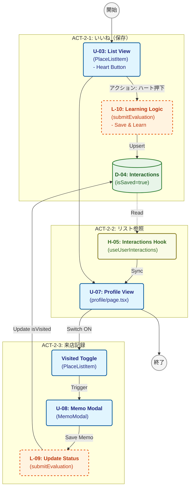
```mermaid
flowchart TD
    %% Define Classes
    classDef ui fill:#e1f5fe,stroke:#01579b,stroke-width:2px,rx:5,ry:5,color:#1a237e,text-align:left
    classDef comp fill:#f9fbe7,stroke:#827717,stroke-width:2px,rx:5,ry:5,color:#33691e,text-align:left
    classDef logic fill:#fff3e0,stroke:#e65100,stroke-width:2px,stroke-dasharray: 5 5,rx:5,ry:5,color:#bf360c,text-align:left
    classDef db fill:#e8f5e9,stroke:#2e7d32,stroke-width:2px,rx:0,ry:0,color:#1b5e20,text-align:left
    classDef startend fill:#f5f5f5,stroke:#9e9e9e,stroke-width:2px,rx:50,ry:50,color:#212121

    S2_Start((開始)):::startend
    S2_End((終了)):::startend

    subgraph ACT_2_1 ["ACT-2-1: いいね（保存）"]
        U_03["<b>U-03: List View</b><br/>(PlaceListItem)<br/>- Heart Button"]:::ui
        L_10["<b>L-10: Learning Logic</b><br/>(submitEvaluation)<br/>- Save & Learn"]:::logic
        D_04[("<b>D-04: Interactions</b><br/>(isSaved=true)")]:::db
        
        U_03 -- "アクション: ハート押下" --> L_10
        L_10 -- "Upsert" --> D_04
    end

    subgraph ACT_2_2 ["ACT-2-2: リスト参照"]
        U_07["<b>U-07: Profile View</b><br/>(profile/page.tsx)"]:::ui
        H_05["<b>H-05: Interactions Hook</b><br/>(useUserInteractions)"]:::comp
        
        D_04 -. "Read" .-> H_05
        H_05 -- "Sync" --> U_07
    end

    subgraph ACT_2_3 ["ACT-2-3: 来店記録"]
        U_07_Toggle["<b>Visited Toggle</b><br/>(PlaceListItem)"]:::ui
        U_08["<b>U-08: Memo Modal</b><br/>(MemoModal)"]:::ui
        L_09["<b>L-09: Update Status</b><br/>(submitEvaluation)"]:::logic
        
        U_07 -- "Switch ON" --> U_07_Toggle
        U_07_Toggle -- "Trigger" --> U_08
        U_08 -- "Save Memo" --> L_09
        L_09 -- "Update isVisited" --> D_04
    end

    S2_Start --> U_03
    U_03 --> U_07
    U_07 --> S2_End
```

#### 3. Test Data Fixtures (Prerequisites)

| Fixture ID | Description | Content Summary | Usage |
|:---|:---|:---|:---|
| **FIX-S2-01** | **Target Place** | 店舗 "Cafe B" (ID: place_b). | 保存対象の店舗データ。 |
| **FIX-S2-02** | **Profile State** | ユーザーの `interactions` コレクション。<br>- `place_b`: `isSaved=true` | プロフィール画面表示時の初期状態。 |

#### 4. Behavior Specifications (Testable)

**Pre-conditions:**
*   User is logged in.
*   Network is online.

**Interaction Steps (Positive Flow):**

| Step ID | Actor | Action (When) | System Behavior (Then - UI) | Component Ref. | Acceptance Criteria (Functional) | Visual Criteria (VRT / Style) |
|:---|:---|:---|:---|:---|:---|:---|
| **S2-01** | User | 検索結果(`U-03`)で「ハート」ボタンをクリック | ボタンが即座に塗りつぶされる(Optimistic UI)。<br>Toast通知 "保存しました" が表示される。 | `PlaceListItem`<br>`(HeartButton)` | `expect(heartBtn).toHaveAttribute("aria-pressed", "true")`<br>`expect(toast).toContainText("保存しました")` | `expect(heartBtn).toHaveScreenshot('S2-01-saved-state.png')`<br>`// Verify Brand Pink`<br>`expect(heartBtn).toHaveCSS('color', 'rgb(236, 72, 153)')` |
| **S2-02** | User | プロフィール画面(`U-07`)へ遷移 | 「Interested (保存済)」タブに、先ほどの店舗 "Cafe B" が表示されている。 | `ProfileView` | `expect(page.url()).toContain("/profile")`<br>`expect(savedList).toContainText("Cafe B")` | `expect(profileView).toHaveScreenshot('S2-02-profile-saved.png')` |
| **S2-03** | User | "Cafe B" の「来店済み」トグルをONにする | メモ入力用モーダル(`U-08`)が開く。 | `MemoModal` | `expect(memoModal).toBeVisible()`<br>`expect(memoModal).toHaveText("来店記録")` | `expect(memoModal).toHaveScreenshot('S2-03-memo-modal.png')` |
| **S2-04** | User | メモ "美味しかった" を入力し保存 | モーダルが閉じ、トグルがON(緑色)になる。<br>リスト上のステータスが更新される。 | `PlaceListItem`<br>`(VisitedToggle)` | `expect(memoModal).not.toBeVisible()`<br>`expect(visitedToggle).toHaveAttribute("aria-checked", "true")` | `expect(visitedToggle).toHaveScreenshot('S2-04-visited-on.png')` |

#### 5. Edge Cases & Validations (Negative Flow)

| ID | Condition | Expected Behavior (UI) | Acceptance Criteria |
|:---|:---|:---|:---|
| **E2-01** | **未ログインで保存** | ログインモーダルまたは警告Toastを表示し、アクションをブロックする。 | `expect(authModal).toBeVisible()`<br>`expect(heartBtn).toHaveAttribute("aria-pressed", "false")` |
| **E2-02** | **来店取消 (ON→OFF)** | 誤操作防止のため確認ダイアログまたはToastで「未訪問に戻しました」と通知。<br>メモデータは保持する(仕様)。 | `expect(toast).toContainText("未訪問に戻しました")`<br>`// Internal State Check`<br>`expect(memoData).not.toBeNull()` |

---

### シナリオ3: 店舗をいいねして傾向を学習させる

#### 1. User Story
ユーザーが店舗に対して「Good（いいね）」評価を行い、その理由（AIタグ）を選択することで、AIがユーザーの好みを学習し、パーソナライズ精度（XP）を向上させる。

#### 2. Interaction Flow (Mermaid)

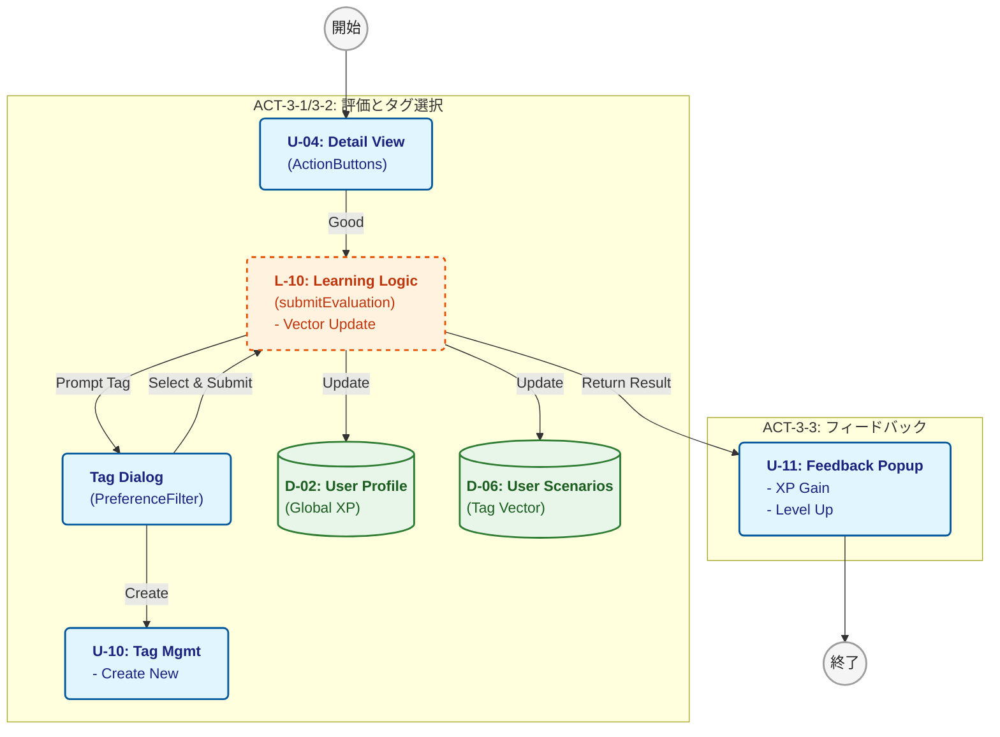
```mermaid
flowchart TD
    %% Define Classes
    classDef ui fill:#e1f5fe,stroke:#01579b,stroke-width:2px,rx:5,ry:5,color:#1a237e,text-align:left
    classDef comp fill:#f9fbe7,stroke:#827717,stroke-width:2px,rx:5,ry:5,color:#33691e,text-align:left
    classDef logic fill:#fff3e0,stroke:#e65100,stroke-width:2px,stroke-dasharray: 5 5,rx:5,ry:5,color:#bf360c,text-align:left
    classDef db fill:#e8f5e9,stroke:#2e7d32,stroke-width:2px,rx:0,ry:0,color:#1b5e20,text-align:left
    classDef startend fill:#f5f5f5,stroke:#9e9e9e,stroke-width:2px,rx:50,ry:50,color:#212121

    S3_Start((開始)):::startend
    S3_End((終了)):::startend

    subgraph ACT_3_1 ["ACT-3-1/3-2: 評価とタグ選択"]
        U_04["<b>U-04: Detail View</b><br/>(ActionButtons)"]:::ui
        U_TagDialog["<b>Tag Dialog</b><br/>(PreferenceFilter)"]:::ui
        U_10["<b>U-10: Tag Mgmt</b><br/>- Create New"]:::ui
        
        L_10["<b>L-10: Learning Logic</b><br/>(submitEvaluation)<br/>- Vector Update"]:::logic
        D_02[("<b>D-02: User Profile</b><br/>(Global XP)")]:::db
        D_06[("<b>D-06: User Scenarios</b><br/>(Tag Vector)")]:::db

        U_04 -- "Good" --> L_10
        L_10 -- "Prompt Tag" --> U_TagDialog
        U_TagDialog -- "Create" --> U_10
        U_TagDialog -- "Select & Submit" --> L_10
        L_10 -- "Update" --> D_02
        L_10 -- "Update" --> D_06
    end

    subgraph ACT_3_3 ["ACT-3-3: フィードバック"]
        U_11["<b>U-11: Feedback Popup</b><br/>- XP Gain<br/>- Level Up"]:::ui
        L_10 -- "Return Result" --> U_11
    end

    S3_Start --> U_04
    U_11 --> S3_End
```

#### 3. Test Data Fixtures (Prerequisites)

| Fixture ID | Description | Content Summary | Usage |
|:---|:---|:---|:---|
| **FIX-S3-01** | **User Profile** | Global XP: 90 (Level 1, Next 100). | レベルアップ演出の検証用。 |
| **FIX-S3-02** | **Evaluation Target** | 店舗 "Spicy Curry X". 特徴: "激辛"。 | 学習対象の店舗。 |

#### 4. Behavior Specifications (Testable)

**Interaction Steps (Positive Flow):**

| Step ID | Actor | Action (When) | System Behavior (Then - UI) | Component Ref. | Acceptance Criteria (Functional) | Visual Criteria (VRT / Style) |
|:---|:---|:---|:---|:---|:---|:---|
| **S3-01** | User | 店舗詳細(`U-04`)で「Good」ボタンをクリック | ボタンがActiveになり、タグ選択用のポップオーバーが表示される。 | `ActionButtons` | `expect(goodBtn).toHaveAttribute("aria-pressed", "true")`<br>`expect(tagPopover).toBeVisible()` | `expect(goodBtn).toHaveCSS('color', 'rgb(236, 72, 153)')` |
| **S3-02** | User | タグ「一人メシ」を選択し決定 | **Learning**: backendでベクトル更新。<br>**Feedback**: `FeedbackPopup`(`U-11`) が表示される。 | `LearningServices` | `await expect(page.locator("text=学習しました")).toBeVisible()` | - |
| **S3-03** | User | フィードバックを確認 | **XP Gain**: "+20 XP" のアニメーションが表示される。<br>**Level Up**: "Level 2" への昇格演出が表示される。 | `FeedbackPopup`<br>`(U-11)` | `expect(popup).toContainText("+20 XP")`<br>`expect(popup).toContainText("Level UP!")` | `expect(popup).toHaveScreenshot('S3-03-levelup.png')`<br>`// Animation Duration`<br>`await expect(popup).not.toBeVisible({ timeout: 4000 })` |

#### 5. Edge Cases & Validations (Negative Flow)

| ID | Condition | Expected Behavior (UI) | Acceptance Criteria |
|:---|:---|:---|:---|
| **E3-01** | **タグ重複作成** | 既に存在するタグ名で新規作成しようとする | エラーメッセージ "そのタグは既に存在します" を表示。 | `expect(errorMsg).toContainText("既に存在します")` |
| **E3-02** | **タグ上限(30個)超過** | 31個目のタグを作成しようとする | 作成ボタンが無効化され、上限到達メッセージを表示。 | `expect(createBtn).toBeDisabled()`<br>`expect(limitMsg).toBeVisible()` |

---

### シナリオ4: 迷った店舗を比較して、AIに決めてもらう (Verdict)

#### 1. User Story
検索結果から候補店舗（2〜3件）をピックアップし、比較トレイに追加。AIに「どっちがいい？」と相談し、論理的な勝敗判定（Verdict）を受け取る。

#### 2. Interaction Flow (Mermaid)

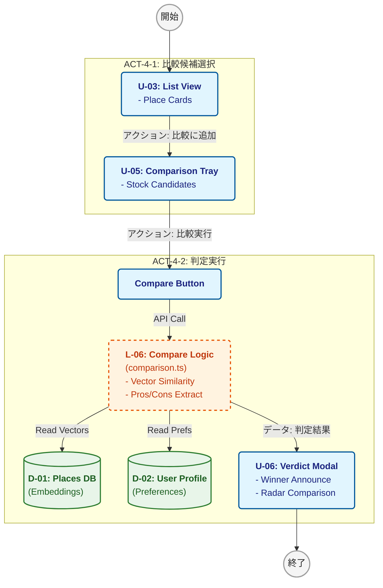
```mermaid
flowchart TD
    %% Define Classes
    classDef ui fill:#e1f5fe,stroke:#01579b,stroke-width:2px,rx:5,ry:5,color:#1a237e,text-align:left
    classDef comp fill:#f9fbe7,stroke:#827717,stroke-width:2px,rx:5,ry:5,color:#33691e,text-align:left
    classDef logic fill:#fff3e0,stroke:#e65100,stroke-width:2px,stroke-dasharray: 5 5,rx:5,ry:5,color:#bf360c,text-align:left
    classDef db fill:#e8f5e9,stroke:#2e7d32,stroke-width:2px,rx:0,ry:0,color:#1b5e20,text-align:left
    classDef startend fill:#f5f5f5,stroke:#9e9e9e,stroke-width:2px,rx:50,ry:50,color:#212121

    S4_Start((開始)):::startend
    S4_End((終了)):::startend

    subgraph ACT_4_1 ["ACT-4-1: 比較候補選択"]
        U_03["<b>U-03: List View</b><br/>- Place Cards"]:::ui
        U_05["<b>U-05: Comparison Tray</b><br/>- Stock Candidates"]:::ui
        
        U_03 -- "アクション: 比較に追加" --> U_05
    end

    subgraph ACT_4_2 ["ACT-4-2: 判定実行"]
        U_05_Btn["<b>Compare Button</b>"]:::ui
        L_06["<b>L-06: Compare Logic</b><br/>(comparison.ts)<br/>- Vector Similarity<br/>- Pros/Cons Extract"]:::logic
        D_01[("<b>D-01: Places DB</b><br/>(Embeddings)")]:::db
        D_02[("<b>D-02: User Profile</b><br/>(Preferences)")]:::db
        U_06["<b>U-06: Verdict Modal</b><br/>- Winner Announce<br/>- Radar Comparison"]:::ui
        
        U_05 -- "アクション: 比較実行" --> U_05_Btn
        U_05_Btn -- "API Call" --> L_06
        L_06 -- "Read Vectors" --> D_01
        L_06 -- "Read Prefs" --> D_02
        L_06 -- "データ: 判定結果" --> U_06
    end

    S4_Start --> U_03
    U_06 --> S4_End
```

#### 3. Test Data Fixtures (Prerequisites)

| Fixture ID | Description | Content Summary | Usage |
|:---|:---|:---|:---|
| **FIX-S4-01** | **Candidates** | 2店舗。<br>- **Place 1**: Cost=5, Atmo=2<br>- **Place 2**: Cost=2, Atmo=5 | 比較対象。 |
| **FIX-S4-02** | **Preference** | ユーザー嗜好: "Atmosphere" 重視。 | 判定ロジックの入力。 |

#### 4. Behavior Specifications (Testable)

**Interaction Steps (Positive Flow):**

| Step ID | Actor | Action (When) | System Behavior (Then - UI) | Component Ref. | Acceptance Criteria (Functional) | Visual Criteria (VRT / Style) |
|:---|:---|:---|:---|:---|:---|:---|
| **S4-01** | User | 検索結果(`U-03`)で2店舗を選択 | 画面下部に `ComparisonTray`(`U-05`) がスライドインする。<br>選択した店舗のサムネイルが表示される。 | `ComparisonTray` | `expect(tray).toBeVisible()`<br>`expect(tray.items).toHaveCount(2)` | `expect(tray).toHaveScreenshot('S4-01-tray-open.png')`<br>`expect(tray).toHaveCSS('position', 'fixed')` |
| **S4-02** | User | トレイの「AIで比較する」ボタンをクリック | **Loading**: 解析中アニメーション。<br>**Complete**: `VerdictModal`(`U-06`) が表示される。 | `VerdictModal` | `expect(modal).toBeVisible()`<br>`expect(loadingSpinner).not.toBeVisible()` | - |
| **S4-03** | User | 判定結果を確認 | **Preference** (Atmosphere重視) に基づき、**Place 2** が "WINNER" と表示される。<br>「なぜなら...」という解説文が表示される。 | `VerdictModal` | `expect(winnerBadge).toBeVisible()`<br>`expect(winnerText).toContainText("Place 2")`<br>`expect(reason).not.toBeEmpty()` | `expect(modal).toHaveScreenshot('S4-03-verdict-winner.png')`<br>`// Verify Crown Icon`<br>`expect(crownIcon).toBeVisible()` |

#### 5. Edge Cases & Validations (Negative Flow)

| ID | Condition | Expected Behavior (UI) | Acceptance Criteria |
|:---|:---|:---|:---|
| **E4-01** | **1店舗のみで実行** | 比較ボタンは無効化(Disabled)されており、クリックできない。 | `expect(compareBtn).toBeDisabled()` |
| **E4-02** | **3店舗以上(上限超過)** | 3店舗目を選択しようとするとToastで「比較は2店舗までです」と警告(仕様変更により2件制限の場合)。 | `expect(toast).toContainText("2店舗まで")` |

---

### シナリオ5: [SEO戦略] 「エリア × 利用シーン」特化のランキングで、目的特化型ユーザーを獲得する

#### 1. User Story
検索エンジンやサイト内フッターから「新宿」などのエリアニーズを持って流入したユーザーが、**エリア特化のディレクトリページ**から目的のシーンを選択し、**詳細なランキングページ**（例: 新宿×デート）へ到達する。
ランキングは**AI分析スコア（重み付け済み）**に基づいて並び替えられ、上位3件には**金・銀・銅のリッチなバッジ**が付与されることで、ひと目で「行くべき店」がわかる。

#### 2. Interaction Flow (Mermaid)

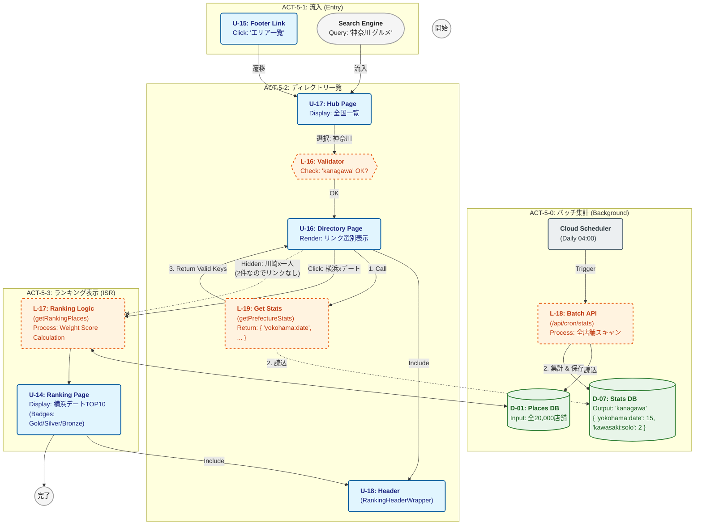
```mermaid
flowchart TD
    %% Define Classes (Same as v1)
    classDef ui fill:#e1f5fe,stroke:#01579b,stroke-width:2px,rx:5,ry:5,color:#1a237e,text-align:left
    classDef comp fill:#f9fbe7,stroke:#827717,stroke-width:2px,rx:5,ry:5,color:#33691e,text-align:left
    classDef logic fill:#fff3e0,stroke:#e65100,stroke-width:2px,stroke-dasharray: 5 5,rx:5,ry:5,color:#bf360c,text-align:left
    classDef db fill:#e8f5e9,stroke:#2e7d32,stroke-width:2px,rx:0,ry:0,color:#1b5e20,text-align:left
    classDef startend fill:#f5f5f5,stroke:#9e9e9e,stroke-width:2px,rx:50,ry:50,color:#212121
    classDef batch fill:#eceff1,stroke:#455a64,stroke-width:2px,rx:5,ry:5,color:#263238,text-align:left

    S5_Start((開始)):::startend
    S5_End((完了)):::startend

    subgraph ACT_5_0 ["ACT-5-0: バッチ集計 (Background)"]
        Scheduler["<b>Cloud Scheduler</b><br/>(Daily 04:00)"]:::batch
        API_Cron["<b>L-18: Batch API</b><br/>(/api/cron/stats)<br/>Process: 全店舗スキャン"]:::logic
        D_01[("<b>D-01: Places DB</b><br/>Input: 全20,000店舗")]:::db
        D_07[("<b>D-07: Stats DB</b><br/>Output: 'kanagawa'<br>{ 'yokohama:date': 15, 'kawasaki:solo': 2 }")]:::db

        Scheduler -- "Trigger" --> API_Cron
        API_Cron -- "1. 読込" --> D_01
        API_Cron -- "2. 集計 & 保存" --> D_07
    end

    subgraph ACT_5_1 ["ACT-5-1: 流入 (Entry)"]
        U_15["<b>U-15: Footer Link</b><br/>Click: 'エリア一覧'"]:::ui
        E_Search["<b>Search Engine</b><br/>Query: '神奈川 グルメ'"]:::startend
    end

    subgraph ACT_5_2 ["ACT-5-2: ディレクトリ一覧"]
        U_17["<b>U-17: Hub Page</b><br/>Display: 全国一覧"]:::ui
        L_16{{"<b>L-16: Validator</b><br/>Check: 'kanagawa' OK?"}}:::logic
        U_16["<b>U-16: Directory Page</b><br/>Render: リンク選別表示"]:::ui
        L_19["<b>L-19: Get Stats</b><br/>(getPrefectureStats)<br/>Return: { 'yokohama:date', ... }"]:::logic
        U_18["<b>U-18: Header</b><br/>(RankingHeaderWrapper)"]:::ui
        
        U_15 -- "遷移" --> U_17
        E_Search -- "流入" --> U_17
        U_17 -- "選択: 神奈川" --> L_16
        L_16 -- "OK" --> U_16
        
        U_16 -- "Include" --> U_18
        U_16 -- "1. Call" --> L_19
        L_19 -. "2. 読込" .-> D_07
        L_19 -- "3. Return Valid Keys" --> U_16
    end

    subgraph ACT_5_3 ["ACT-5-3: ランキング表示 (ISR)"]
        L_17["<b>L-17: Ranking Logic</b><br/>(getRankingPlaces)<br/>Process: Weight Score Calculation"]:::logic
        U_14["<b>U-14: Ranking Page</b><br/>Display: 横浜デートTOP10<br>(Badges: Gold/Silver/Bronze)"]:::ui
        
        U_16 -- "Click: 横浜xデート" --> L_17
        U_16 -. "Hidden: 川崎x一人<br>(2件なのでリンクなし)" .-x L_17
        
        L_17 <--> D_01
        L_17 --> U_14
        U_14 -- "Include" --> U_18
    end

    U_14 --> S5_End
```

#### 3. Test Data Fixtures (Prerequisites)

| Fixture ID | Description | Content Summary | Usage |
|:---|:---|:---|:---|
| **FIX-S5-01** | **Shinjuku Date Ranking** | エリア「新宿」、シーン「デート」の店舗10件。<br>- **Rank 1**: "Bar X" (RawScore=4.0, DateWeight=1.2 => Final=4.8)<br>- **Rank 2**: "Izakaya Y" (RawScore=4.5, DateWeight=0.8 => Final=3.6) | `getRankingPlaces` モック、またはDBシードデータ。<br>重み付けによる順位変動を確認する。 |

#### 4. Behavior Specifications (Testable)

**Pre-conditions:**
*   Test Environment uses `FIX-S5-01` data.
*   Allowlist in `src/constants/areas.ts` includes "tokyo/shinjuku" and scene "date".

**Interaction Steps (Positive Flow):**

| Step ID | Actor | Action (When) | System Behavior (Then - UI) | Component Ref. | Acceptance Criteria (Functional) | Visual Criteria (VRT / Style) |
|:---|:---|:---|:---|:---|:---|:---|
| **S5-01** | User | `/rankings/tokyo/shinjuku/date` へアクセス | ステータス200 OK。<br>共通ヘッダー(`U-18`)が表示されている。<br>タイトル "新宿のデート向き..." が表示される。 | `RankingPage`<br>`RankingHeaderWrapper` | `expect(response.status()).toBe(200)`<br>`expect(page.locator("nav")).toBeVisible()`<br>`expect(page.locator("h1")).toHaveText(/新宿のデート向き/)` | `expect(page).toHaveScreenshot('S5-01-page.png')`<br>`// Header Check`<br>`expect(header).toBeVisible()` |
| **S5-02** | User | ランキングリストを確認 | **Weighted Score** に基づき、"Bar X" (4.8) が1位に表示される。<br>上位3件には金・銀・銅のバッジが付与される。 | `RankingList`<br>`(PlaceListItem)` | `expect(cards.nth(0)).toContainText("Bar X")`<br>`expect(cards.nth(0).score).toHaveText("4.8")`<br>`expect(cards.nth(1)).toContainText("Izakaya Y")` | `expect(rankingList).toHaveScreenshot('S5-02-list-items.png')`<br>`// Badge Check`<br>`expect(goldBadge).toHaveCSS('background-image', /linear-gradient/)` |
| **S5-03** | User | 構造化データを確認 (Technical) | JSON-LD `ItemList` がDOMに含まれている。 | `SchemaMarkup` | `const jsonLd = await page.locator('script[type="application/ld+json"]').innerText()`<br>`expect(JSON.parse(jsonLd)['@type']).toBe('ItemList')` | - |
| **S5-04** | User | ヘッダーのロゴをクリック | トップページ (`/`) に遷移する。 | `Header` | `expect(page.url()).toBe("http://localhost:3000/")` | - |

#### 5. Edge Cases & Validations (Negative Flow)

| ID | Condition | Expected Behavior (UI) | Acceptance Criteria |
|:---|:---|:---|:---|
| **E5-01** | **不正なエリアパラメータ**<br>`/rankings/tokyo/nowhere/date` | バリデーションエラーとなり、標準の404ページを表示する。 | `expect(page.locator("h1")).toHaveText("404")`<br>`expect(page.title()).toContain("Not Found")` |
| **E5-02** | **不正なシーンパラメータ**<br>`/rankings/tokyo/shinjuku/sleeping` | バリデーションエラーとなり、標準の404ページを表示する。 | `expect(page.locator("h1")).toHaveText("404")` |
| **E5-03** | **中間階層アクセス**<br>`/rankings/tokyo` などのディレクトリ | トップページへリダイレクトする(現状仕様)。<br>*将来的にディレクトリページ実装予定* | `expect(page.url()).toBe("http://localhost:3000/")` |
| **E5-04** | **データ不足 (0件)**<br>有効エリアだが店舗がない | "見つかりませんでした" 表示。<br>`noindex` メタタグの出力。 | `expect(emptyMessage).toBeVisible()`<br>`expect(meta_robots).toHaveAttribute("content", "noindex")` |

---

### シナリオ6: [集客] 地域ごとの月間/週間閲覧ランキングページをSNSに配信して集客する

#### 1. User Story
運営チーム（またはBot）が定期的に「今週の渋谷デートTop3」のようなランキングをSNSに投稿し、SNSユーザーが興味を持ってクリックし、アプリ内のランキングLPまたは店舗詳細へ流入する。

#### 2. Interaction Flow (Mermaid)

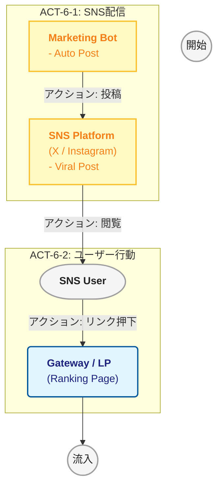
```mermaid
flowchart TD
    classDef startend fill:#f5f5f5,stroke:#9e9e9e,stroke-width:2px,rx:50,ry:50,color:#212121
    classDef ui fill:#e1f5fe,stroke:#01579b,stroke-width:2px,rx:5,ry:5,color:#1a237e,text-align:left
    classDef ext fill:#fff9c4,stroke:#fbc02d,stroke-width:2px,rx:0,ry:0,color:#f57f17,text-align:left

    S6_Start((開始)):::startend
    S6_End((流入)):::startend

    subgraph ACT_6_1 ["ACT-6-1: SNS配信"]
        Bot["<b>Marketing Bot</b><br/>- Auto Post"]:::ext
        SNS["<b>SNS Platform</b><br/>(X / Instagram)<br/>- Viral Post"]:::ext
        
        Bot -- "アクション: 投稿" --> SNS
    end

    subgraph ACT_6_2 ["ACT-6-2: ユーザー行動"]
        User["<b>SNS User</b>"]:::startend
        L_Gateway["<b>Gateway / LP</b><br/>(Ranking Page)"]:::ui
        
        SNS -- "アクション: 閲覧" --> User
        User -- "アクション: リンク押下" --> L_Gateway
    end

    L_Gateway --> S6_End
```

#### 3. Test Data & Behavior
*   **Fixture**: SNS Inbound Param (`?utm_source=twitter&utm_medium=social`)
*   **Check**: LPが正しく表示され、Analyticsイベントが発火すること。

---

### シナリオ7: [集客] 店舗を検索して他人にURLを共有する（バイラルループ）

#### 1. User Story
ユーザーが気に入った店舗の詳細ページを、LINEやクリップボード経由で友人にシェアする。URLを受け取った友人は、OGP画像（店舗画像＋スコア）を見て興味を持ち、アプリを開く。

#### 2. Interaction Flow (Mermaid)

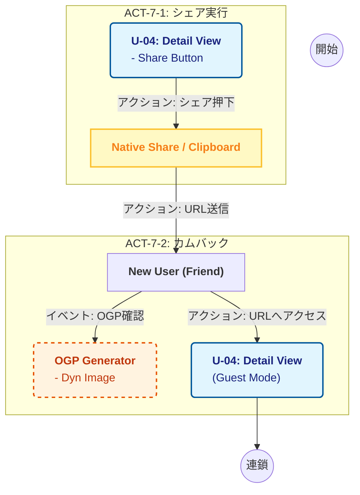
```mermaid
flowchart TD
    classDef ui fill:#e1f5fe,stroke:#01579b,stroke-width:2px,rx:5,ry:5,color:#1a237e,text-align:left
    classDef logic fill:#fff3e0,stroke:#e65100,stroke-width:2px,stroke-dasharray: 5 5,rx:5,ry:5,color:#bf360c,text-align:left
    classDef ext fill:#fff9c4,stroke:#fbc02d,stroke-width:2px,rx:0,ry:0,color:#f57f17,text-align:left

    S7_Start((開始)):::startend
    S7_End((連鎖)):::startend

    subgraph ACT_7_1 ["ACT-7-1: シェア実行"]
        U_Detail["<b>U-04: Detail View</b><br/>- Share Button"]:::ui
        System["<b>Native Share / Clipboard</b>"]:::ext
        
        U_Detail -- "アクション: シェア押下" --> System
    end

    subgraph ACT_7_2 ["ACT-7-2: カムバック"]
        Friend["<b>New User (Friend)</b>"]:::startend
        OGP["<b>OGP Generator</b><br/>- Dyn Image"]:::logic
        U_Landing["<b>U-04: Detail View</b><br/>(Guest Mode)"]:::ui
        
        System -- "アクション: URL送信" --> Friend
        Friend -- "イベント: OGP確認" --> OGP
        Friend -- "アクション: URLへアクセス" --> U_Landing
    end

    U_Landing --> S7_End
```

#### 3. Test Data & Behavior
*   **Visual**: シェアボタンが表示されていること。
*   **Functional**: クリック時に `navigator.share` またはクリップボードAPIが呼ばれること。

---

### シナリオ8: [マネタイズ] 非会員ユーザーが会員登録を行う（リード獲得）

#### 1. User Story
非会員ユーザーが「保存」や「Good」などの会員限定アクションを行おうとした際、ログインモーダルが表示され、メリット（AI学習）を理解した上でGoogleログインを行う。その後、元のアクションが自動的に再開される。

#### 2. Interaction Flow (Mermaid)

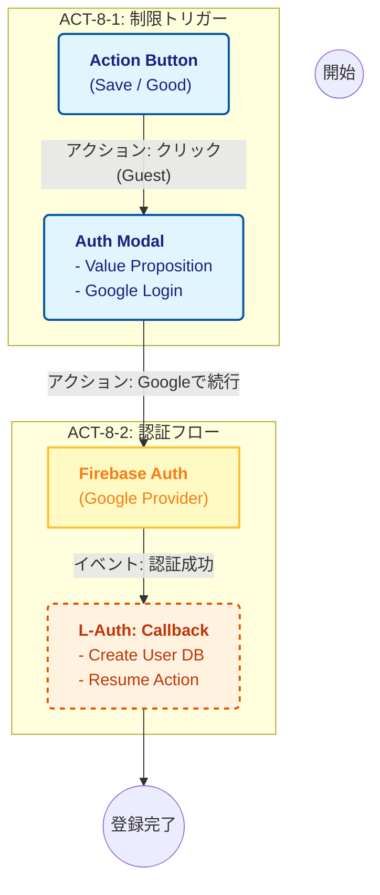
```mermaid
flowchart TD
    classDef ui fill:#e1f5fe,stroke:#01579b,stroke-width:2px,rx:5,ry:5,color:#1a237e,text-align:left
    classDef logic fill:#fff3e0,stroke:#e65100,stroke-width:2px,stroke-dasharray: 5 5,rx:5,ry:5,color:#bf360c,text-align:left
    classDef ext fill:#fff9c4,stroke:#fbc02d,stroke-width:2px,rx:0,ry:0,color:#f57f17,text-align:left

    S8_Start((開始)):::startend
    S8_End((登録完了)):::startend

    subgraph ACT_8_1 ["ACT-8-1: 制限トリガー"]
        U_Action["<b>Action Button</b><br/>(Save / Good)"]:::ui
        U_Auth["<b>Auth Modal</b><br/>- Value Proposition<br/>- Google Login"]:::ui
        
        U_Action -- "アクション: クリック(Guest)" --> U_Auth
    end

    subgraph ACT_8_2 ["ACT-8-2: 認証フロー"]
        AuthProv["<b>Firebase Auth</b><br/>(Google Provider)"]:::ext
        L_Callback["<b>L-Auth: Callback</b><br/>- Create User DB<br/>- Resume Action"]:::logic
        
        U_Auth -- "アクション: Googleで続行" --> AuthProv
        AuthProv -- "イベント: 認証成功" --> L_Callback
    end

    L_Callback --> S8_End
```

#### 3. Test Data & Behavior
*   **Check**: 未ログイン状態で `HeartButton` を押すと `AuthModal` が表示される (`toBeVisible`)。

---

### シナリオ9: [マネタイズ] 無課金ユーザーが動画広告を閲覧して機能を解放する

#### 1. User Story
無料プランユーザーが詳細分析の閲覧制限にかかった際、動画広告を視聴することで一時的に閲覧権限（トークン）を獲得し、情報を閲覧する。

#### 2. Interaction Flow (Mermaid)

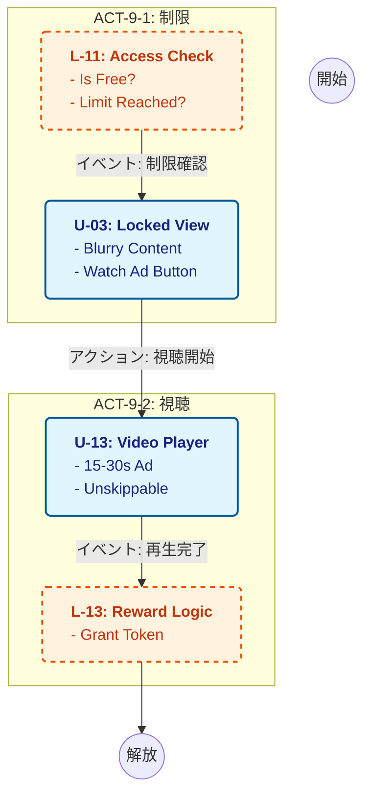
```mermaid
flowchart TD
    classDef ui fill:#e1f5fe,stroke:#01579b,stroke-width:2px,rx:5,ry:5,color:#1a237e,text-align:left
    classDef logic fill:#fff3e0,stroke:#e65100,stroke-width:2px,stroke-dasharray: 5 5,rx:5,ry:5,color:#bf360c,text-align:left

    S9_Start((開始)):::startend
    S9_End((解放)):::startend

    subgraph ACT_9_1 ["ACT-9-1: 制限"]
        L_Check["<b>L-11: Access Check</b><br/>- Is Free?<br/>- Limit Reached?"]:::logic
        U_Locked["<b>U-03: Locked View</b><br/>- Blurry Content<br/>- Watch Ad Button"]:::ui
        
        L_Check -- "イベント: 制限確認" --> U_Locked
    end

    subgraph ACT_9_2 ["ACT-9-2: 視聴"]
        U_Ad["<b>U-13: Video Player</b><br/>- 15-30s Ad<br/>- Unskippable"]:::ui
        L_Reward["<b>L-13: Reward Logic</b><br/>- Grant Token"]:::logic
        
        U_Locked -- "アクション: 視聴開始" --> U_Ad
        U_Ad -- "イベント: 再生完了" --> L_Reward
    end

    L_Reward --> S9_End
```

---

### シナリオ10: [マネタイズ] ヘビーユーザーがサブスクリプションを購入する

#### 1. User Story
ヘビーユーザーが広告や制限の解除を求め、プレミアムプラン（月額500円）に申し込みを行う。

#### 2. Interaction Flow (Mermaid)

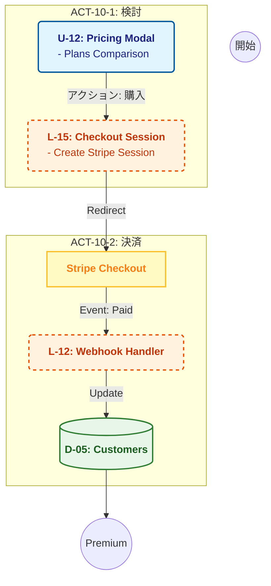
```mermaid
flowchart TD
    classDef ui fill:#e1f5fe,stroke:#01579b,stroke-width:2px,rx:5,ry:5,color:#1a237e,text-align:left
    classDef logic fill:#fff3e0,stroke:#e65100,stroke-width:2px,stroke-dasharray: 5 5,rx:5,ry:5,color:#bf360c,text-align:left
    classDef ext fill:#fff9c4,stroke:#fbc02d,stroke-width:2px,rx:0,ry:0,color:#f57f17,text-align:left
    classDef db fill:#e8f5e9,stroke:#2e7d32,stroke-width:2px,rx:0,ry:0,color:#1b5e20,text-align:left

    S10_Start((開始)):::startend
    S10_End((Premium)):::startend

    subgraph ACT_10_1 ["ACT-10-1: 検討"]
        U_Pricing["<b>U-12: Pricing Modal</b><br/>- Plans Comparison"]:::ui
        L_Checkout["<b>L-15: Checkout Session</b><br/>- Create Stripe Session"]:::logic
        
        U_Pricing -- "アクション: 購入" --> L_Checkout
    end

    subgraph ACT_10_2 ["ACT-10-2: 決済"]
        Stripe["<b>Stripe Checkout</b>"]:::ext
        L_Webhook["<b>L-12: Webhook Handler</b>"]:::logic
        D_Cust[("<b>D-05: Customers</b>")]:::db
        
        L_Checkout -- "Redirect" --> Stripe
        Stripe -- "Event: Paid" --> L_Webhook
        L_Webhook -- "Update" --> D_Cust
    end

    D_Cust --> S10_End
```

---

### シナリオ11: [マネタイズ] サブスクリプションを継続させる（チャーン防止）

#### 1. User Story
更新時期にレポートを受け取り、サービスの価値（除外した店、見つけた店）を再認識して継続を選択する。

#### 2. Interaction Flow (Mermaid)

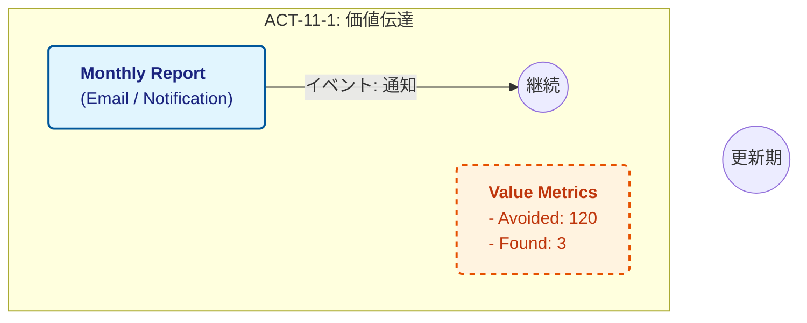
```mermaid
flowchart TD
    classDef ui fill:#e1f5fe,stroke:#01579b,stroke-width:2px,rx:5,ry:5,color:#1a237e,text-align:left
    classDef logic fill:#fff3e0,stroke:#e65100,stroke-width:2px,stroke-dasharray: 5 5,rx:5,ry:5,color:#bf360c,text-align:left

    S11_Start((更新期)):::startend
    S11_End((継続)):::startend

    subgraph ACT_11_1 ["ACT-11-1: 価値伝達"]
        Report["<b>Monthly Report</b><br/>(Email / Notification)"]:::ui
        Metric["<b>Value Metrics</b><br/>- Avoided: 120<br/>- Found: 3"]:::logic
        
        Report -- "イベント: 通知" --> S11_End
    end
```

---

### シナリオ12: [マネタイズ] 詳細画面から予約して成果報酬を得る（送客手数料）

#### 1. User Story
店舗詳細画面から外部予約サイト（ホットペッパー等）へ遷移し、予約完了することで成果報酬が発生する。

#### 2. Interaction Flow (Mermaid)

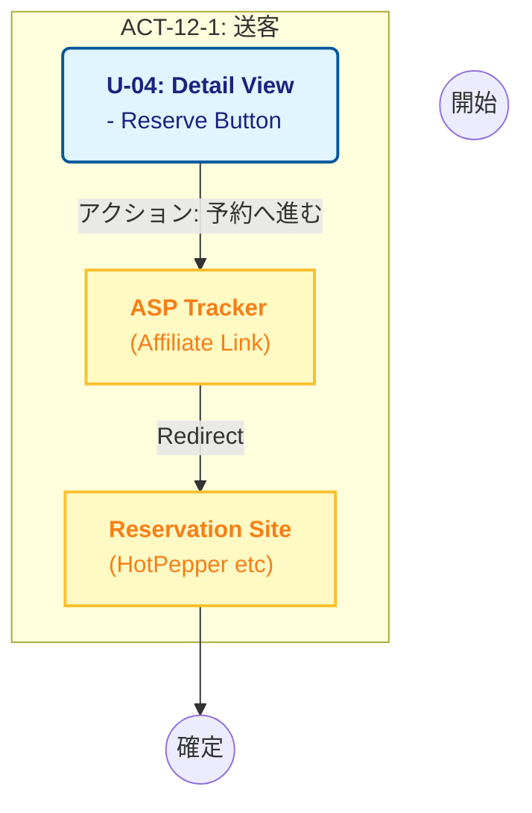
```mermaid
flowchart TD
    classDef ui fill:#e1f5fe,stroke:#01579b,stroke-width:2px,rx:5,ry:5,color:#1a237e,text-align:left
    classDef ext fill:#fff9c4,stroke:#fbc02d,stroke-width:2px,rx:0,ry:0,color:#f57f17,text-align:left

    S12_Start((開始)):::startend
    S12_End((確定)):::startend

    subgraph ACT_12_1 ["ACT-12-1: 送客"]
        U_Detail["<b>U-04: Detail View</b><br/>- Reserve Button"]:::ui
        ASP["<b>ASP Tracker</b><br/>(Affiliate Link)"]:::ext
        Site["<b>Reservation Site</b><br/>(HotPepper etc)"]:::ext
        
        U_Detail -- "アクション: 予約へ進む" --> ASP
        ASP -- "Redirect" --> Site
    end
    
    Site --> S12_End
```

---

### シナリオ13: [マネタイズ] ユーザーがサブスクリプションを解約する

#### 1. User Story
ユーザーがサブスクリプションの解約を希望し、安全な外部ポータル（Stripe）経由で手続きを行う。即時解約ではなく期間満了まで利用可能とする。

#### 2. Interaction Flow (Mermaid)

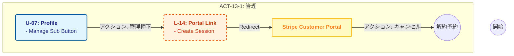
```mermaid
flowchart TD
    classDef ui fill:#e1f5fe,stroke:#01579b,stroke-width:2px,rx:5,ry:5,color:#1a237e,text-align:left
    classDef logic fill:#fff3e0,stroke:#e65100,stroke-width:2px,stroke-dasharray: 5 5,rx:5,ry:5,color:#bf360c,text-align:left
    classDef ext fill:#fff9c4,stroke:#fbc02d,stroke-width:2px,rx:0,ry:0,color:#f57f17,text-align:left
    classDef db fill:#e8f5e9,stroke:#2e7d32,stroke-width:2px,rx:0,ry:0,color:#1b5e20,text-align:left

    S13_Start((開始)):::startend
    S13_End((解約予約)):::startend

    subgraph ACT_13_1 ["ACT-13-1: 管理"]
        U_Profile["<b>U-07: Profile</b><br/>- Manage Sub Button"]:::ui
        L_Portal["<b>L-14: Portal Link</b><br/>- Create Session"]:::logic
        Stripe["<b>Stripe Customer Portal</b>"]:::ext
        
        U_Profile -- "アクション: 管理押下" --> L_Portal
        L_Portal -- "Redirect" --> Stripe
        Stripe -- "アクション: キャンセル" --> S13_End
    end
```

---

### シナリオ14: [コスト] 検索時のAPI・AIコストを最小化するキャッシュフロー

#### 1. User Story
システム内部の挙動。ユーザー検索時、まず軽量なTextSearch(ID)のみ行い、DBキャッシュをチェック。有効なキャッシュがあれば詳細APIコールをスキップし、コストを削減する。

#### 2. Interaction Flow (Mermaid)

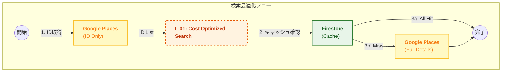
```mermaid
flowchart TD
    classDef ui fill:#e1f5fe,stroke:#01579b,stroke-width:2px,rx:5,ry:5,color:#1a237e,text-align:left
    classDef logic fill:#fff3e0,stroke:#e65100,stroke-width:2px,stroke-dasharray: 5 5,rx:5,ry:5,color:#bf360c,text-align:left
    classDef db fill:#e8f5e9,stroke:#2e7d32,stroke-width:2px,rx:0,ry:0,color:#1b5e20,text-align:left
    classDef ext fill:#fff9c4,stroke:#fbc02d,stroke-width:2px,rx:0,ry:0,color:#f57f17,text-align:left

    S14_Start((開始)):::startend
    S14_End((完了)):::startend

    subgraph ACT_14 ["検索最適化フロー"]
        L_Search["<b>L-01: Cost Optimized Search</b>"]:::logic
        API_ID["<b>Google Places</b><br/>(ID Only)"]:::ext
        DB["<b>Firestore</b><br/>(Cache)"]:::db
        API_Full["<b>Google Places</b><br/>(Full Details)"]:::ext
        
        S14_Start -- "1. ID取得" --> API_ID
        API_ID -- "ID List" --> L_Search
        L_Search -- "2. キャッシュ確認" --> DB
        DB -- "3a. All Hit" --> S14_End
        DB -- "3b. Miss" --> API_Full
        API_Full --> S14_End
    end
```

---

<br/>

## 3. 次のステップ

本仕様書（v2.3）に基づき、以下の順序で開発を進めます。

1.  **UI実装 & VRT整備**: 定義された `U-xx` コンポーネントを実装し、Storybook/VRTテストを作成。
2.  **ロジック実装**: `L-xx` ロジックを実装し、Unit Testで検証。
3.  **結合**: `Interaction Flow` に従い、UIとロジックを結合。
4.  **E2Eテスト**: `Behavior Specifications` に記述されたシナリオ通りのE2Eテストを実装し、Quality Gateとする。
