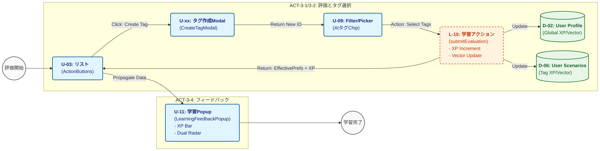
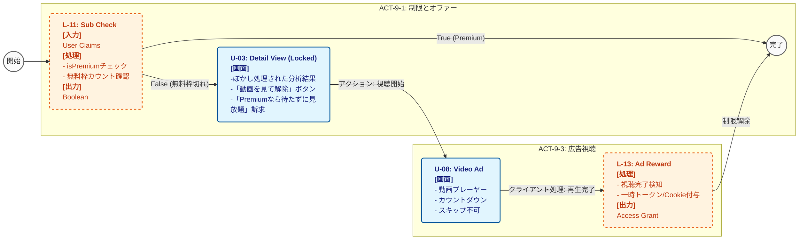
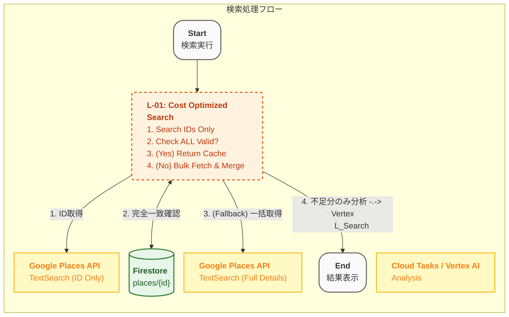

# 1. プロジェクト仕様書：AI Concierge for グルメ

## 1.1. はじめに
本アプリケーションは、Googleマップの口コミデータをAIを用いて分析し、ユーザーの価値観に合わせて店舗を提案するコンシェルジュアプリケーションです。
この章では、アプリケーションの概要を説明します。

<br>

## 1.2. 技術スタック概要

詳細は [`docs/architecture.md`](./docs/architecture.md) を参照。

*   **Frontend/Backend**: Next.js 14+ (App Router)
*   **Styling**: Tailwind CSS + Lucide React
*   **Database**: Google Cloud Firestore (Cache & Analysis storage)
*   **AI**: Vertex AI (Gemini 2.0 Flash)
*   **Infrastructure**: Google Cloud Run + Cloud Tasks

<br>

## 1.3. マネタイズ戦略
**AARRRモデル** を満たすようシステム機能を設計する。
収益は主に動画広告収入、アフィリエイト、サブスクリプションを想定する。

**参考：AARRRモデル**

ユーザーがサービスを知ってから収益を生むまでのステップを5段階に分解する。どこでユーザーが離脱しているか、どこを改善すれば収益が上がるかを特定するのに最適。
* Acquisition (獲得): ユーザーがサイトやアプリに来る（SEO、SNS）。
* Activation (活性化): ユーザーが初めて価値を感じる（登録、初回利用）。
* Retention (継続): 繰り返し使う。
* Referral (紹介): 他人に勧める。
* Revenue (収益): マネタイズ。 課金や広告閲覧が発生する。

<br>

## 1.4. デザインガイドライン (Design Guidelines)

### 配色設計 (Color Scheme)
ブランドイメージである「高級感」「温かみ」「食欲」を表現するため、以下の配色ルールを厳守する。

**1. Primary Brand Color**
*   **Color Code**: `#E65100` (Material Orange 900)
*   **名称**: Burnt Orange / Brand Orange
*   **用途**:
    *   サイト全体のキーカラー
    *   Primary Action Button (AI比較ボタン等)
    *   強調アイコン (王冠、No.1バッジ)
    *   ヘッダー等のアクセントボーダー
*   `src/app/globals.css` にて `--color-brand` として定義済。


**2. Base Colors**
*   **見出しテキスト**: `#3E3E3E` (淡めの黒)
    *   `src/app/globals.css` にて `--color-brand-black` として定義済。
*   **本文テキスト**: `brand-black/80`
*   **補足テキスト**: `brand-black/50`
*   **枠線**: `brand-gray`
*   **背景**: `brand-gray-light`
    *   純白(`FFFFFF`)のカードを目立たせるため、ベース背景にはごく薄いグレーを使用する。

**3. Functional Colors (Evaluation Axes)**
詳細分析および比較表では、各評価軸を直感的に識別するため固定色を使用する。
*   **味**: `rose-500` (Dish / Rose)
*   **接客**: `pink-500` (Service / Pink) - ハートフルな印象
*   **雰囲気**: `amber-500` (Atmosphere / Amber) - 煌びやかさ
*   **コスパ**: `emerald-500` (Cost / Emerald) - お得感・プラス収支


**4. Implementation Note**
*   Tailwind v4 導入に伴い、`globals.css` での変数定義（`--color-brand` 等）を活用し、ハードコードを減らす方針とする。

<br>
<br>

# 2. 基本設計：ユーザーシナリオ別インタラクションフロー定義

## 2.1. はじめに
この章では、ユーザーシナリオをベースにして、システムのインタラクションフローを定義します。<br/>
 
**インタラクションフローの凡例**
*   青色: User Interface
*   黄緑色: Component
*   赤色: Logic
*   紫色: AI
*   緑色: Database
*   灰色: Start/End
*   **共通ステート定義**:
    *   **Loading**: スケルトンスクリーンまたはスピナーを表示し、操作をブロックする（Disable）。
    *   **Error**: Toast通知（一時的エラー）またはAlert表示（永続的エラー/Empty State）を行う。
    *   **Empty**: "No Data" などのプレースホルダーを表示する。


<br>

## 2.2. 設計要素一覧

各コンポーネントの実装状況と処理内容の定義です。

### User Interface (U-xx)
| ID | 名前 | Status | File / Component | 詳細 (Trigger + IPO) |
| :--- | :--- | :--- | :--- | :--- |
| **U-01** | **Home Hero** | **Implemented** | `src/components/home/HeroSection.tsx`<br>`src/components/home/ServiceBenefits.tsx` | **Trigger**: アクセス / ホームリセット<br>**Process**: 背景画像と検索窓(`SearchInput`)、サービスの価値提案を表示。<br>**Output**: ヒーローセクション描画。<br>**Validation**: 検索語句は1〜100文字。空文字入力時はボタン無効化。
| **U-02** | **App Shell** | **Implemented** | `src/app/page.tsx`<br>(Container) | **Trigger**: ルートアクセス<br>**Process**: URL同期、Auth状態監視、ビューの切り替え管理(`HOME`\|`LIST`\|`DETAIL`)。<br>**Output**: 適切なビューコンポーネントのマウント。 |
| **U-03** | **List View** | **Implemented** | `src/components/places/PlaceListView.tsx` | **Trigger**: `view=LIST`<br>**Process**: 検索バー、Stickyフィルター(U-12)、店舗リスト(PlaceList)を表示。<br>**Output**: 検索結果画面。<br>**State**: Loading(Skeleton x 5), Error(Toast), Empty(Illustration).
| **U-04** | **Detail View** | **Implemented** | `src/components/places/PlaceDetailView.tsx` | **Trigger**: `view=DETAIL`<br>**Process**: 詳細ナビゲーション、詳細分析(AnalysisResult)を表示。<br>**Output**: 詳細分析画面。 |
| **U-05** | **Comparison Tray** | **Implemented** | `src/components/ComparisonTray.tsx` | **Trigger**: 複数店舗の選択<br>**Process**: 画面下部に比較候補をストックし表示する。<br>**Output**: 比較トレイUI。 |
| **U-06** | **Verdict Modal** | **Implemented** | `src/components/VerdictModal.tsx` | **Trigger**: 比較実行ボタン<br>**Process**: AI判定結果(Winner/Loser)を表示する。<br>**Output**: 判定モーダル。 |
| **U-07** | **Profile View** | **Implemented** | `src/app/profile/page.tsx`<br>`PlaceListItem.tsx` | **Trigger**: `/profile`遷移<br>**Process**: Interaction履歴取得、タブ切り替え、リスト表示。<br>**Output**: マイページ表示。 |
| **U-08** | **Memo Modal** | **Implemented** | `src/components/MemoModal.tsx` | **Trigger**: U-07の鉛筆ボタン<br>**Process**: `<dialog>`で最前面表示。メモ・タグ入力。<br>**Output**: メモ入力ダイアログ。<br>**Constraint**: Memo max 500 chars (絵文字可). Tags max 5 items.
| **U-09** | **Preference Filter** | **Implemented** | `src/components/PreferenceFilter.tsx` | **Trigger**: 常時(Sticky)<br>**Process**: 4軸トグル、シーン選択、AIタグ選択、自動/手動モード切替を内包するアコーディオン。<br>**Output**: フィルタUI。 |
| **U-10** | **Tag Management** | **Implemented** | `src/app/settings/tags/page.tsx` | **Trigger**: プロフィールメニュー<br>**Process**: AIタグの一覧表示、作成、削除。<br>**Output**: タグ設定画面。 |
| **U-11** | **Feedback Popup** | **Implemented** | `src/components/LearningFeedbackPopup.tsx` | **Trigger**: タグ決定後 (未選択含む)<br>**Process**: 学習結果と**AI習熟度(XP)**の可視化。<br>- Generic: Global傾向を表示。<br>- Tagged: Global vs Tagの比較レーダーを表示。<br>- **Proficiency**: Global/Tag XPバーを表示。<br>**Output**: フィードバックアニメーション (Duration: 3000ms, Auto-Close).
| **U-12** | **Pricing Modal** | <span style="color:red">Pending</span> | - | **Trigger**: プレミアム機能アクセス<br>**Process**: プラン比較表と購入ボタン(Stripe Link)を表示。<br>**Output**: 課金誘導モーダル。 |
| **U-13** | **Video Ad** | <span style="color:red">Pending</span> | - | **Trigger**: 無料制限到達<br>**Process**: 動画広告を再生し、完了までブロックする。<br>**Output**: 動画プレーヤー。 |

### Logic (L-xx) & Hooks
| ID | 名前 | Status | File / Method | 詳細 (Trigger + IPO) |
| :--- | :--- | :--- | :--- | :--- |
| **H-01** | **Filter Logic** | **Implemented** | `src/hooks/useFilterParams.ts` | **Trigger**: フィルタUI操作<br>**Process**: `focus`, `scenes`, `tags` のURLパラメータとReact Stateを双方向同期。<br>**Output**: `focusedAxes` 等の状態と `handleToggle` 関数。 |
| **H-02** | **Score Logic** | **Implemented** | `src/hooks/usePersonalizedScores.ts` | **Trigger**: 検索結果更新 or フィルタ変更<br>**Process**: `getPersonalizedScores` (L-03) を呼び出し、スコアと `effectivePrefs` (L-08) を管理。<br>**Output**: `pScores` (Map), `effectivePrefs`。 |
| **H-03** | **Sort Logic** | **Implemented** | `src/hooks/usePlaceSorter.ts` | **Trigger**: `pScores` 更新 or ソート順変更<br>**Process**: リアルタイムデータ統合と、AIスコア/Google評価に基づくソート。<br>**Output**: `sortedPlaces`。 |
| **H-04** | **Realtime Places** | **Implemented** | `src/hooks/useRealtimePlaces.ts` | **Trigger**: `places` IDリスト変更<br>**Process**: Firestoreの`places`コレクションをリアルタイム監視(onSnapshot)し、データ更新を検知。<br>**Output**: `realtimePlaces` (Map)。 |
| **H-05** | **Interactions Hook** | **Implemented** | `src/hooks/useUserInteractions.ts` | **Trigger**: プロフィール画面など<br>**Process**: ユーザーの全インタラクション履歴を取得。<br>**Output**: `interactions`。 |
| **H-06** | **Status Hook** | **Implemented** | `src/hooks/useUserInteractionStatus.ts` | **Trigger**: 各店舗カード表示<br>**Process**: 特定店舗に対する自分のアクション状態(`isSaved`, `isVisited`など)を取得。<br>**Output**: `status` オブジェクト。 |
| **L-01** | **Search Process** | **Implemented** | `src/server/actions/place.ts`<br>`searchPlaces` | **Trigger**: 検索実行<br>**Input**: `query` (String)<br>**Process**: コスト最適化フロー。<br>1. TextSearch(Full)で20件一括取得。<br>2. DBキャッシュ照合(分析済確認)。<br>3. 新規・期限切れのみ分析キューへ追加。<br>**Output**: `PlaceSearchResult[]` |
| **L-02** | **Async Analysis** | **Implemented** | `src/server/actions/place.ts`<br>`enqueueAnalysis` | **Trigger**: 検索/詳細取得時 (Status!=completed)<br>**Input**: `placeId`<br>**Process**: Cloud Tasksへ分析タスクをエンキュー。<br>**Output**: Void (Fire-and-forget) |
| **L-03** | **Re-ranking** | **Implemented** | `src/server/actions/personalize.ts` (Controller)<br>`src/server/services/scoring.ts` (Logic) | **Trigger**: リスト表示・更新時 (H-02)<br>**Input**: `placeIds`, `uid`, `scenarioIds`, `mode`<br>**Process**: **Scenario-Based Blended Scoring**。<br>Global好みとTagごとの好みをブレンドし、`effectivePreferences` を算出。<br>**Output**: `PScore[]` (w/ `effectivePreferences`) |
| **L-06** | **Compare Logic** | **Implemented** | `src/server/actions/comparison.ts` (Controller) | **Trigger**: 比較実行<br**Input**: `placeIds`, `uid`, `scenarioIds`<br>**Process**: L-03同様のブレンドベクトルを作成し、Cos類似度でランク付け。Pros/Cons抽出。<br>**Output**: `ComparisonResult` (Winner, Matrix) |
| **L-09** | **Update Status** | **Implemented** | `src/server/actions/user.ts`<br>`submitEvaluation` | **Trigger**: 来店済チェック<br>**Input**: `uid`, `placeId`, `evaluation` (null if just visited)<br>**Process**: `submitEvaluation` が `isVisited: true` を更新する。<br>**Output**: Void |
| **L-10** | **Learning Logic** | **Implemented** | `src/server/actions/user.ts`<br>`submitEvaluation` | **Trigger**: Good/Bad評価/タグ選択<br>**Input**: `uid`, `placeId`, `evaluation`, `scenarioIds`<br>**Process**: <br>1. 前回評価のUndo。<br>2. 新評価のApply (Global & Scenarios)。<br>3. `blendPreferences` による `effectivePreferences` の算出。<br>4. **Proficiency XP Increment** (Global/Tag)。<br>**Output**: `preferences`, `experience`, `effectivePreferences` |

### Database (D-xx)
| ID | 名前 | Status | Collection / Path | 概要 |
| :--- | :--- | :--- | :--- | :--- |
| **D-01** | **Places DB** | **Implemented** | `places/{placeId}` | 店舗基本情報＋AI分析結果。 |
| **D-02** | **User Profile** | **Implemented** | `users/{uid}` | ユーザー基本情報＋嗜好ベクトル。 |
| **D-03** | **Analysis** | **Implemented** | `places/{placeId}` | (D-01内包) 感情分析・4軸スコア・特徴量。 |
| **D-04** | **Interactions** | **Implemented** | `users/{uid}/interactions/{placeId}` | ユーザー行動履歴(Save, Good/Bad)と学習ログ。 |
| **D-05** | **Customers** | <span style="color:red">Pending</span> | `customers/{uid}` | Stripe連携用の決済・契約情報。 |
| **D-06** | **User Scenarios** | **Implemented** | `users/{uid}/scenarios/{scenarioId}` | ユーザー作成のカスタムシーン(ベクトルなど)を保存するサブコレクション。 |

#### Schema Details

**D-01 / D-03: Places Collection (`places/{placeId}`)**
> [!NOTE]
> **Data Type Mapping**: Frontend uses standard JS `Date` objects, while Firestore uses `Timestamp`. Converters are placed in `src/utils/firebase/converters.ts`.
> `createdAt` and `updatedAt` are managed by Server Actions to ensure server time consistency.

```typescript
interface Place {
  id: string;             // Google Place ID
  name: string;           // 店舗名
  location: { lat: number; lng: number };
  nearestStation?: string;

  // AI Analysis (D-03)
  status: 'pending' | 'processing' | 'completed' | 'error';
  summary?: string[];       // AI要約（リスト形式）
  axisScores?: {          // 4軸スコア (0-5)
    taste: number; service: number; atmosphere: number; cost: number;
  };
  usageScores?: {         // シーン適性 (0-5)
    date: number; solo: number; business: number; family: number; group: number;
  };
  embeddingVector?: number[]; // Vertex AI Embedding (768-dim)

  // External Data
  hotpepper?: HotPepperData; // ホットペッパー連携データ
  originalRating: number;   // Google Rating
  userRatingsTotal: number;
  priceLevel?: string;    // PRICE_LEVEL_MODERATE etc.
  address?: string;       // Formatted Address
  
  updatedAt: Timestamp;
}
```

**D-02: Users Collection (`users/{uid}`)**
```typescript
interface UserProfile {
  uid: string;
  displayName: string;
  email: string;

  // Personalization Core
  preferenceVector?: number[]; // ユーザーの「好み」を表すベクトル (EMA更新)
  aiPreferences: {             // 4軸の重視度重み (Linear更新)
    taste: number; service: number; atmosphere: number; cost: number;
  };

  // Explicit Settings
  favoriteAreas: string[];     // ["Shinjuku", "Ginza"]
  favoriteGenres: string[];    // ["Sushi", "Italian"]
  
  // AI Proficiency (F-07)
  experience: number;          // Global Experience (Total XP)
  // Level = floor(experience / 100) + 1
}
```

**D-06: User Scenarios Subcollection (`users/{uid}/scenarios/{scenarioId}`)**
```typescript
interface UserScenario {
  id: string;
  name: string;
  isCustom: boolean;        // true: User Created, false: Default
  
  // Scenario Context
  aiPreferences: { ... };   // Tag Context Preference
  preferenceVector: number[]; // Tag Context Vector

  // Tag Proficiency (F-07)
  experience: number;       // Tag Experience
  // Level = floor(experience / 100) + 1
}
```

**D-04: Interactions Subcollection (`users/{uid}/interactions/{placeId}`)**
```typescript
interface UserInteraction {
  placeId: string;
  uid: string;

  // Flags
  isSaved: boolean;    // 保存状態
  isVisited: boolean;  // 来店記録

  // Visited Memo (Added 2026/01)
  memo?: string;       // 自由記述メモ
  repeat?: 'yes' | 'no' | 'maybe'; // リピート意向タグ

  // Evaluation (Learning Log)
  evaluation?: {
    type: 'good' | 'bad';
    timestamp: Timestamp;
    // どの軸/特徴が要因だったか
    selectedFeatureKeys: string[]; 
    axisImpact?: { taste: number; ... }; // Undo用のDelta記録
  };
  updatedAt: Timestamp;
}
```

<br/>

## 2.3. ユーザーシナリオ

### シナリオ1: 店舗を手動検索して評価する

#### シナリオ説明
*   **ACT-1-S：Start**: 正確性を求めるユーザー「デート、イベントなどで一番良い店に行きたい。総合星スコアだけでは納得感が得られない。」
*   **ACT-1-1：LP訪問**: ユーザーはトップページを開き、サービスの世界観（「AIコンシェルジュ」）を認知する。
*   **ACT-1-2：検索実行**: 「表参道 イタリアン」「静かな店」などの条件を入力し、検索を実行する。
    *   **Validation**: 1文字以上100文字以内の入力必須。特殊記号のみは許可しない。
*   **ACT-1-3：リスト確認**: 検索結果リストが表示される。各カードにはAIが算出した「4軸スコア（味・接客・雰囲気・コスパ）」が表示されている。
*   **ACT-1-4：価値観選択&スコア最適化**: 「今日は雰囲気を重視したい」と考え、フィルター機能で「雰囲気」を優先選択する。リストの並び順とスコアが即座に再計算される。
    *   **Acceptance Criteria**: 「雰囲気」重視選択時、Atmosphereスコア4.0以上の店舗が上位3件以内に含まれること（該当店舗が存在する場合）。
*   **ACT-1-5：詳細表示**: 気になった店舗をクリックし、詳細分析画面（レーダーチャートや要約）を見る。星評価では得られない深い情報を**簡単かつ瞬時に**得る
*   **ACT-1-6：比較検討**: ブラウザバック、またはナビゲーションでリストに戻り、比較候補トレイを活用して横断的に比較する。
*   **ACT-1-7：選択**: 気になって店舗の中で最もふさわしい店を決定する
*   **ACT-1-E：End**: 「わかりやすく情報が参照できたため、一人で考えるより迅速かつ正確に店選びができた。」

#### インタラクションフロー

```mermaid
%%{init: {'flowchart': {'useMaxWidth': false, 'rankSpacing': 60, 'nodeSpacing': 30}}}%%
flowchart LR
    %% Definitions
    classDef ui fill:#e1f5fe,stroke:#01579b,stroke-width:2px,rx:5,ry:5,color:#1a237e,text-align:left
    classDef logic fill:#fff3e0,stroke:#e65100,stroke-width:2px,stroke-dasharray: 5 5,rx:5,ry:5,color:#bf360c,text-align:left
    classDef ai fill:#f3e5f5,stroke:#4a148c,stroke-width:2px,rx:5,ry:5,color:#4a148c,text-align:left
    classDef db fill:#e8f5e9,stroke:#2e7d32,stroke-width:2px,rx:0,ry:0,color:#1b5e20,text-align:left
    classDef startend fill:#fafafa,stroke:#666,stroke-width:2px,rx:20,ry:20,color:#333

    %% Row 1: Search & Discovery
    subgraph ACT_1_S ["ACT-1-S: 開始"]
        direction TB
        Start((ニーズ発生)):::startend
    end

    subgraph ACT_1_1 ["ACT-1-1: LP訪問"]
        direction TB
        U_01["<b>U-01: Hero Section</b><br/>(HeroSection.tsx)<br/>- 検索入力"]:::ui
    end

    subgraph ACT_1_2 ["ACT-1-2: 検索実行 & リスト表示"]
        direction TB
        U_Page["<b>U-02: App Shell</b><br/>(page.tsx)<br/>- URL管理<br/>- フック初期化"]:::ui
        U_List["<b>U-03: リスト画面</b><br/>(PlaceListView.tsx)"]:::ui
        
        L_01["<b>L-01: 検索アクション</b><br/>(searchPlaces)<br/>- コスト最適化フロー"]:::logic
        L_02["<b>L-02: 分析トリガー</b><br/>(enqueueAnalysis)"]:::logic
        A_01["<b>A-01: AIワーカー</b><br/>(Cloud Tasks)<br/>- Gemini 2.0 Flash"]:::ai
        D_01[("<b>D-01: 店舗DB</b><br/>(Firestore)")]:::db
    end

    subgraph ACT_1_4 ["ACT-1-4: パーソナライズ & ソート"]
        direction TB
        U_Filter["<b>U-09: Preference Filter</b><br/>(PreferenceFilter.tsx)<br/>- Sticky Accordion"]:::ui
        H_Filter["<b>H-01: Filter Hook</b><br/>(useFilterParams)<br/>- State/URL Sync"]:::logic
        H_Score["<b>H-02: Score Hook</b><br/>(usePersonalizedScores)<br/>- Fetch Scores"]:::logic
        H_Sort["<b>H-03: Sort Hook</b><br/>(usePlaceSorter)<br/>- Merge & Sort"]:::logic
        L_03["<b>L-03: スコア計算Server</b><br/>(getPersonalizedScores)"]:::logic
    end

    subgraph ACT_1_5 ["ACT-1-5: 詳細・比較"]
        direction TB
        U_Detail["<b>U-04: 詳細画面</b><br/>(PlaceDetailView.tsx)"]:::ui
        U_Tray["<b>U-05: 比較トレイ</b><br/>(ComparisonTray.tsx)"]:::ui
        L_06["<b>L-06: 比較アクション</b>"]:::logic
    end

    subgraph ACT_1_E ["ACT-1-E: 終了"]
        direction TB
        End((店決定)):::startend
    end

    %% Flows
    ACT_1_S --> ACT_1_1
    ACT_1_1 -- "アクション: 検索実行" --> U_Page
    U_Page -- "マウント" --> U_List

    %% Search Loop
    U_List -- "サーバー処理: 検索リクエスト" --> L_01
    L_01 <-- "同期: キャッシュ確認" --> D_01
    L_01 -- "返却: IDリスト" --> U_List
    
    %% Async Analysis
    L_01 -. "非同期: 分析キュー追加" .-> L_02
    L_02 -.-> A_01
    A_01 -. "Write" .-> D_01
    D_01 -. "Realtime Listener" .-> H_Sort

    %% Personalization Loop (Hook Driven)
    U_List -- "イベント: ロード完了/フィルタ変更" --> H_Score
    U_Filter -- "アクション: 軸/タグ変更" --> H_Filter
    H_Filter -- "State Update" --> H_Score
    H_Score -- "Server Action" --> L_03
    L_03 <-- "Read Vectors" --> D_01
    L_03 -- "Return Scores" --> H_Score
    H_Score -- "Pass Scores" --> H_Sort
    H_Sort -- "Return Sorted List" --> U_List

    %% Detail & Compare
    U_List -- "アクション: カード選択" --> U_Detail
    U_List -- "アクション: トレイ追加" --> U_Tray
    U_Detail -- "アクション: トレイ追加" --> U_Tray
    U_Tray -- "アクション: 比較実行" --> L_06
    
    %% End
    U_Detail --> End
    L_06 --> End
```
<br/>

### シナリオ2: 店舗を「いいね」して興味リストに入れ、来店履歴を管理する

#### シナリオ説明
*   **ACT-2-S：Start**: ユーザーが検索結果から気になる店を見つける。
*   **ACT-2-1：いいね（保存）**: ユーザーは「ハート（いいね）」ボタンを押下する。これにより「興味あり（Saved）」として記録され、ポジティブな嗜好学習も行われる。（※従来の「保存」ボタンと「Good」評価はハートボタンに統合された）
*   **ACT-2-2：リスト確認**: 後日、プロフィール画面の「Interested (興味あり)」タブを開き、ハートをつけた店舗一覧を確認する。
*   **ACT-2-3：来店**: 実際に店舗を訪れる。
*   **ACT-2-4：来店済みチェック**: プロフィール画面で対象店舗の「来店済み」トグルをONにする。
    *   **Note**: 誤操作でOFFに戻した場合、`isVisited`フラグのみをfalseに戻し、入力されたメモや評価データは**保持**する。ユーザーには「ステータスを未訪問に戻しました」とToast表示する。
*   **ACT-2-E：End**: 「興味を持った店を逃さずストックし、訪問記録としても活用する。」

#### インタラクションフロー

```mermaid
%%{init: {'flowchart': {'useMaxWidth': false, 'rankSpacing': 40, 'nodeSpacing': 20}}}%%
flowchart LR
    %% Definitions
    classDef ui fill:#e1f5fe,stroke:#01579b,stroke-width:2px,rx:5,ry:5,color:#1a237e,text-align:left
    classDef comp fill:#f0f4c3,stroke:#827717,stroke-width:2px,rx:5,ry:5,color:#33691e,text-align:left
    classDef logic fill:#fff3e0,stroke:#e65100,stroke-width:2px,stroke-dasharray: 5 5,rx:5,ry:5,color:#bf360c,text-align:left
    classDef db fill:#e8f5e9,stroke:#2e7d32,stroke-width:2px,rx:0,ry:0,color:#1b5e20,text-align:left
    classDef startend fill:#fafafa,stroke:#666,stroke-width:2px,rx:20,ry:20,color:#333

    %% Start/End
    S2_Start(("<b>S-2: Start</b><br/>検索結果")):::startend
    S2_End(("<b>E-2: End</b><br/>記録完了")):::startend

    subgraph ACT_2_1 ["ACT-2-1: いいね（ハート）"]
        direction TB
        U_Card["<b>U-03: カード</b><br/>(PlaceListItem)<br/>- ActionButtons"]:::ui
        L_Eval["<b>L-10: 学習ロジック</b><br/>(submitEvaluation)<br/>- isSaved=true<br/>- type=good"]:::logic
        D_04_S2[("<b>D-04: 行動履歴</b><br/>(Interactions)")]:::db
        
        U_Card -- "アクション: ハート押下" --> L_Eval
        L_Eval -- "Upsert: 興味あり" --> D_04_S2
    end

    subgraph ACT_2_2 ["ACT-2-2: プロフィール確認"]
        direction TB
        U_Profile["<b>U-07: Profile View</b><br/>(profile/page.tsx)<br/>- Tab: Interested"]:::ui
        L_Fetch["<b>L-08: データ取得</b><br/>(getUserInteractions)"]:::logic
        
        D_04_S2 -. "Read" .-> L_Fetch
        L_Fetch -- "Display List" --> U_Profile
    end

    subgraph ACT_2_4 ["ACT-2-4: 来店チェック & メモ"]
        direction TB
        C_Toggle["<b>来店トグル</b><br/>(Status Toggle)"]:::comp
        C_Pencil["<b>鉛筆アイコン</b><br/>(Edit Memo)"]:::comp
        U_Memo["<b>U-08: Memo Modal</b><br/>(MemoModal)<br/>- Textarea<br/>- Repeat Badge"]:::ui
        
        L_Status["<b>L-09: ステータス更新</b><br/>(toggleVisited)"]:::logic
        L_Memo["<b>updateInteractionMemo</b><br/>(Server Action)"]:::logic
        
        U_Profile -- "Switch ON" --> C_Toggle
        C_Toggle -- "Call" --> L_Status
        L_Status -- "Set isVisited=true" --> D_04_S2
        
        L_Status -. "Show Pencil" .-> C_Pencil
        C_Pencil -- "Click" --> U_Memo
        U_Memo -- "Submit" --> L_Memo
        L_Memo -- "Update" --> D_04_S2
    end

    S2_Start --> ACT_2_1
    ACT_2_1 --> ACT_2_2
    ACT_2_2 -- "来店後" --> ACT_2_4
    ACT_2_4 --> S2_End
```

<br/>

### シナリオ3: 店舗をいいねして傾向を学習させる

#### シナリオ説明
*   **ACT-3-S：Start**: ユーザーは検索結果からある店舗を気に入ったが、「これはデート向きというより、一人で来たい店だ」と感じている。
*   **ACT-3-1：評価**: ユーザーは店舗に対して「Good（いいね）」を押下する。
*   **ACT-3-2：AIタグ選択**:
    *   システムは「Good! AIタグを追加して学習させますか？」とトーストを表示する。
    *   **Step A (既存選択)**: 既存の「激辛」「静か」などのタグを選択する。
    *   **Step B (新規作成)**: 適切なタグがない場合、「+ AIタグを作成」を選択し、「一人メシ」という名前で登録・選択する。
        *   **Validation**: 同一名タグは作成不可（エラー表示）。1ユーザーあたり最大30個まで。
*   **ACT-3-3：コンテキスト学習**: システムは選択されたタグID（`scenarioId`として管理）に基づいて、学習を行う。
    1.  **Global学習**: ユーザー全体の好みベクトルを更新（ベース学習）。
    2.  **Tag学習**: 「一人メシ」タグ専用のベクトルを新規作成・更新する。
*   **ACT-3-4：AI Proficiency (習熟度)**:
    *   **ランクアップルール**: **100 XPごとにレベルアップ**し、Lv.10 (1000 XP) で「Master」となる。
    *   **XP獲得**: シグナル強度に応じて XP を付与する。`submitEvaluation`内で一括処理される。
        *   **Global**: **+20 XP** /回。
        *   **Tag**: **+100 XP** /回。
    *   **可視化**: 
        *   **ポップアップ**: `LearningFeedbackPopup` にて、アニメーション付きで獲得XPと現在のレベルを表示。
            *   **Dismiss**: 3000ms経過後に自動的にフェードアウトして消滅する。クリックで即時非表示可。
*   **ACT-3-5：フィードバック**:
    *   画面右上に**学習結果ポップアップ**が表示される。
    *   「Global（普段の好み）」と「Tag（今回のタグ特化）」のレーダーチャートが重ねて表示され、AIの学習結果が可視化される。
*   **ACT-3-E：End**: 「自分の操作によってAIが賢くなったことを直感的に理解する。」

#### インタラクションフロー

```mermaid
%%{init: {'flowchart': {'useMaxWidth': false, 'rankSpacing': 60, 'nodeSpacing': 30}}}%%
flowchart LR
    %% Definitions
    classDef ui fill:#e1f5fe,stroke:#01579b,stroke-width:2px,rx:5,ry:5,color:#1a237e,text-align:left
    classDef logic fill:#fff3e0,stroke:#e65100,stroke-width:2px,stroke-dasharray: 5 5,rx:5,ry:5,color:#bf360c,text-align:left
    classDef db fill:#e8f5e9,stroke:#2e7d32,stroke-width:2px,rx:0,ry:0,color:#1b5e20,text-align:left
    classDef startend fill:#fafafa,stroke:#666,stroke-width:2px,rx:20,ry:20,color:#333

    %% Start/End
    S3_Start((評価開始)):::startend
    S3_End((学習完了)):::startend

    subgraph ACT_3_1 ["ACT-3-1/3-2: 評価とタグ選択"]
        direction TB
        U_List["<b>U-03: リスト</b><br/>(ActionButtons)"]:::ui
        U_Modal["<b>U-xx: タグ作成Modal</b><br/>(CreateTagModal)"]:::ui
        U_Picker["<b>U-09: Filter/Picker</b><br/>(AIタグChip)"]:::ui
        
        L_10["<b>L-10: 学習アクション</b><br/>(submitEvaluation)<br/>- XP Increment<br/>- Vector Update"]:::logic
        
        D_02[("<b>D-02: User Profile</b><br/>(Global XP/Vector)")]:::db
        D_06[("<b>D-06: User Scenarios</b><br/>(Tag XP/Vector)")]:::db
    end

    subgraph ACT_3_4 ["ACT-3-4: フィードバック"]
        direction TB
        U_11["<b>U-11: 学習Popup</b><br/>(LearningFeedbackPopup)<br/>- XP Bar<br/>- Dual Radar"]:::ui
    end

    %% Flows - Phase 1: Interaction
    S3_Start --> U_List
    U_List -- "Click: Create Tag" --> U_Modal
    U_Modal -- "Return New ID" --> U_Picker
    
    %% Flows - Phase 2: Submission
    U_Picker -- "Action: Select Tags" --> L_10
    
    %% Flows - Phase 3: Processing
    L_10 -- "Update" --> D_02
    L_10 -- "Update" --> D_06
    
    %% Flows - Phase 4: Feedback
    L_10 -- "Return: EffectivePrefs + XP" --> U_List
    U_List -- "Propagate Data" --> U_11
    U_11 --> S3_End

    
```

### シナリオ4: AIコンシェルジュチャットボットで「対話的」に最適な店を見つける

#### シナリオ説明
*   **ACT-4-S：Start**: 「検索条件を入れるのが面倒。ざっくりとした相談で決めてほしい。」ユーザーはLPまたはナビゲーションバーから「AIコンシェルジュ」を起動する。
*   **ACT-4-1：ヒアリング**: AIは「コンサルタント」として振る舞い、「デートですか？それとも接待ですか？相手はどんな雰囲気を好みますか？」と、検索条件（What）だけでなく利用背景（Why）を引き出す。
*   **ACT-4-2：実行 (Function Calling)**: 対話内容からパラメータを抽出し、以下のバックエンド機能を自律的に実行する。
    1.  `searchPlaces(keyword, area)`: 広範囲の候補取得。
    2.  `analyzeReviews(ids)`: 候補のAI分析。
    3.  `compareShops(ids, criteria)`: ユーザーの要望（例: 「静かさ重視」）に基づき、候補を比較・フィルタリングする。※ここでの比較はUI上限を超えた数（例: 20件）を処理可能。
*   **ACT-4-3：提案 (Top 3)**: 厳選された3店舗のみを提示する。「A店はここが最高ですが、少し騒がしいかも。B店は静かですが、少し予算オーバーです」といった、比較情報を含めたプレゼンを行う。
*   **ACT-4-4：調整**: ユーザーが「もう少し安いところない？」と返答すると、AIはフィードバックを加味して再度検索・分析ループを実行する。
*   **ACT-4-E：End**: 「会話するだけで、自分で探すよりも納得感のある『正解』に辿り着いた。」

#### インタラクションフロー
*(TBD)*

<br/>

### シナリオ5: [SEO戦略] 「エリア × 利用シーン」特化のランキングで、目的特化型ユーザーを獲得する

#### シナリオ説明
*   **ACT-5-S：Start**: 検索エンジンのクローラー、またはユーザーがトップページを閲覧する。
*   **ACT-5-1：トップレベル認知 (LP)**: 
    *   **ユーザー体験**: ブラウザの基本位置情報を取得し、「現在地（例: 渋谷区）周辺のシーン別ランキング」をタブ切り替えで即座に表示する。
    *   **クローラー対策**: footer等のリンク集から、全エリア・全シーンへの静的リンク網（ディレクトリ）を発見する。
*   **ACT-5-2：構造化 (Directory)**: 
    *   **UX対策 (Filter)**: リンク膨大化に備え、ディレクトリページには「エリア名即時フィルター」を設置し、ユーザーが目的の市区町村に一瞬で到達できるようにする。
    *   **SEO対策 (Hierarchy)**: スパム判定（リンクファーム）を回避するため、全リンクを1ページに羅列せず、「都道府県」→「主要エリア/市区町村」→「利用シーン」といった**階層構造（ピラミッド型）**でページを分割・内部リンクを設計する。これにより、自然なサイト構造として評価させる。
*   **ACT-5-3：詳細インデックス**: 各シーンごとのページには、厳選された店舗リストが掲載されている。
*   **ACT-5-4：評価**: 網羅的かつ専門的なコンテンツとして検索エンジンに高く評価される。
*   **ACT-5-E：End**: 「ニッチな需要（例: 『六本木 接待 隠れ家』）でも検索1位を獲得し、質の高いユーザーを低コストで集客する。」

#### インタラクションフロー
*(TBD)*

<br/>

### シナリオ6: [集客戦略] 地域ごとの月間/週間閲覧ランキングページをSNSに配信して集客する

#### シナリオ説明
*   **ACT-6-S：Start**: 運営チームがSNS（X, Instagram）で定期配信を行う、またはユーザーがシェアする。
*   **ACT-6-1：配信**: 「【渋谷デート】今週、AIスコアが急上昇した隠れ家イタリアンTOP3👑」というフックのあるコピーと共に、生成されたランキングページのURLをシェアする。
*   **ACT-6-2：流入**: SNSユーザーが「自分の知っている店が入っているか」「新しい店はどこか」に興味を持ち、リンクをクリックする。
*   **ACT-6-3：着地**: ランキングの1位〜3位だけをチラ見せし、「4位以下を見る」または「詳細を見る」でLPまたは一覧画面へスムーズに誘導する。
*   **ACT-6-E：End**: 「潜在層が『このアプリなら信頼できそう』と感じ、初回訪問から検索利用へ転換する。」

#### インタラクションフロー
*(TBD)*

<br/>

### シナリオ7: [集客戦略] 店舗を検索して他人にURLを共有する（バイラルループ）

#### シナリオ説明
*   **ACT-7-S：Start**: 「見つけたこの店、パートナーに共有して意見を聞きたい。」
*   **ACT-7-1：共有**: 詳細画面の「シェア」ボタンを押下する。LINEやクリップボードコピーを選択できる。
*   **ACT-7-2：OGP表示**: シェアされたURLには、店舗の「写真」「AI分析による3行要約スコア」がOGP画像としてリッチに表示され、クリック率を高める。
*   **ACT-7-3：閲覧**: 受け取った相手（非会員）は、アプリインストール不要でブラウザですぐに詳細情報（AI分析レポート）を確認できる。
*   **ACT-7-4：連鎖**: 相手も「ここいいね、他にもないかな？」と興味を持ち、そのままサイト内で検索を開始する。
*   **ACT-7-E：End**: 「既存ユーザーが新規ユーザーを連れてくる、自律的な成長サイクル（バイラルループ）が回る。」

#### インタラクションフロー
*(TBD)*

<br/>

### シナリオ8: [マネタイズ戦略] 非会員ユーザーが会員登録を行う（リード獲得）

#### シナリオ説明
*   **ACT-8-S：Start**: 「この店を保存しておきたい。」「もっと自分好みにAIを育てたい。」
*   **ACT-8-1：障壁**: ユーザーが「保存」ボタンや「Good」ボタンを押すと、ログインモーダルが優しく表示される。
*   **ACT-8-2：訴求**: 単なる機能制限ではなく、「ログインすると、あなたの『辛口好み』をAIが学習して、ハズレ店を除外します」というベネフィットを提示する。
*   **ACT-8-3：登録**: Googleログイン（ワンタップ）で登録を完了する。面倒な入力フォームは一切排除する。
*   **ACT-8-4：再開**: 登録完了後、元の画面に戻り、押そうとしていた「保存」アクションが自動で実行完了される（体験を分断しない）。
*   **ACT-8-E：End**: 「ユーザーはストレスなくアクティブ化し、システムは貴重な学習データを獲得する。」

#### インタラクションフロー
*(TBD)*

<br/>

### シナリオ9: [マネタイズ戦略] 無課金ユーザーが動画広告を閲覧して機能を解放する
#### シナリオ説明
*   **ACT-9-S：Start**: 「詳しく見たいが、今日の無料枠を使い切ってしまった。」
*   **ACT-9-1：制限**: 詳細情報の重要な部分（AIディープ分析）にぼかしが入り、「動画を見て続きを見る」ボタンが表示される。
*   **ACT-9-2：選択**: ユーザーは「課金するほどではないが、この店だけはどうしても知りたい」と考え、広告視聴を選択する。
*   **ACT-9-3：視聴**: 15〜30秒の動画広告を視聴完了する。
*   **ACT-9-4：報酬**: 対象店舗の分析レポートが即座に解放され、閲覧可能になる。有料会員は**このプロセスを自動スキップ**する。
*   **ACT-9-E：End**: 「ユーザーにとっては『実質無料』、運営にとっては『広告収益』というWin-Winの関係が成立する。」

#### インタラクションフロー

```mermaid
%%{init: {'flowchart': {'useMaxWidth': false, 'rankSpacing': 40, 'nodeSpacing': 20}}}%%
flowchart LR
    %% Definitions
    classDef startend fill:#fafafa,stroke:#666,stroke-width:2px,rx:20,ry:20,color:#333
    classDef ui fill:#e1f5fe,stroke:#01579b,stroke-width:2px,rx:5,ry:5,color:#1a237e,text-align:left
    classDef comp fill:#f0f4c3,stroke:#827717,stroke-width:2px,rx:5,ry:5,color:#33691e,text-align:left
    classDef logic fill:#fff3e0,stroke:#e65100,stroke-width:2px,stroke-dasharray: 5 5,rx:5,ry:5,color:#bf360c,text-align:left
    classDef ai fill:#f3e5f5,stroke:#4a148c,stroke-width:2px,rx:5,ry:5,color:#4a148c,text-align:left
    classDef db fill:#e8f5e9,stroke:#2e7d32,stroke-width:2px,rx:0,ry:0,color:#1b5e20,text-align:left
    classDef startend fill:#fafafa,stroke:#666,stroke-width:2px,rx:20,ry:20,color:#333

    S9_Start((開始)):::startend
    S9_End((完了)):::startend
    
    subgraph ACT_9_1 ["ACT-9-1: 制限とオファー"]
        direction TB
        L_11_S9["<b>L-11: Sub Check</b><br/><b>[入力]</b><br/>User Claims<br/><b>[処理]</b><br/>- isPremiumチェック<br/>- 無料枠カウント確認<br/><b>[出力]</b><br/>Boolean"]:::logic
        U_03_S9["<b>U-03: Detail View (Locked)</b><br/><b>[画面]</b><br/>-ぼかし処理された分析結果<br/>-「動画を見て解除」ボタン<br/>-「Premiumなら待たずに見放題」訴求"]:::ui
        
        L_11_S9 -- "False (無料枠切れ)" --> U_03_S9
        L_11_S9 -- "True (Premium)" --> S9_End
    end

    subgraph ACT_9_3 ["ACT-9-3: 広告視聴"]
        direction TB
        U_08_S9["<b>U-08: Video Ad</b><br/><b>[画面]</b><br/>- 動画プレーヤー<br/>- カウントダウン<br/>- スキップ不可"]:::ui
        L_13_S9["<b>L-13: Ad Reward</b><br/><b>[処理]</b><br/>- 視聴完了検知<br/>- 一時トークン/Cookie付与<br/><b>[出力]</b><br/>Access Grant"]:::logic

        U_03_S9 -- "アクション: 視聴開始" --> U_08_S9
        U_08_S9 -- "クライアント処理: 再生完了" --> L_13_S9
    end

    S9_Start --> L_11_S9
    L_13_S9 -- "制限解除" --> S9_End
```

<br/>

### シナリオ10: [マネタイズ戦略] ヘビーユーザーがサブスクリプションを購入する
#### シナリオ説明
*   **ACT-10-S：Start**: 「広告が煩わしい。」「制限を気にせず、全エリアのAIコンシェルジュを使い倒したい。」
*   **ACT-10-1：オファー**: 検索画面やマイページに「Premiumプラン: 月額500円」のバナーが表示される。特に「AIコンシェルジュ無制限」「広告非表示」が強調される。
*   **ACT-10-2：検討**: LPにて、無料プランとの比較表を見る。「月1回のランチ代で、一生の店選び失敗を防げます」というコピーに納得する。
*   **ACT-10-3：購入**: Stripe決済などでクレジットカード登録を行い、Premium会員になる。
*   **ACT-10-E：End**: 「ストレスフリーな最高級の探索体験を手に入れ、アプリが手放せないツールになる。」

#### インタラクションフロー

```mermaid
%%{init: {'flowchart': {'useMaxWidth': false, 'rankSpacing': 40, 'nodeSpacing': 20}}}%%
flowchart LR
    %% Definitions
    classDef startend fill:#fafafa,stroke:#666,stroke-width:2px,rx:20,ry:20,color:#333
    classDef ui fill:#e1f5fe,stroke:#01579b,stroke-width:2px,rx:5,ry:5,color:#1a237e,text-align:left
    classDef comp fill:#f0f4c3,stroke:#827717,stroke-width:2px,rx:5,ry:5,color:#33691e,text-align:left
    classDef logic fill:#fff3e0,stroke:#e65100,stroke-width:2px,stroke-dasharray: 5 5,rx:5,ry:5,color:#bf360c,text-align:left
    classDef ai fill:#f3e5f5,stroke:#4a148c,stroke-width:2px,rx:5,ry:5,color:#4a148c,text-align:left
    classDef db fill:#e8f5e9,stroke:#2e7d32,stroke-width:2px,rx:0,ry:0,color:#1b5e20,text-align:left

    S10_Start((開始)):::startend
    S10_End((完了)):::startend
    
    subgraph ACT_10_2 ["ACT-10-2: プラン検討"]
        direction TB
        U_07_S10["<b>U-07: Pricing Modal</b><br/><b>[画面]</b><br/>- Free vs Premium比較表<br/>- 動画広告スキップ訴求<br/>- 月額500円ボタン"]:::ui
    end

    subgraph ACT_10_3 ["ACT-10-3: 決済 (Stripe)"]
        direction TB
        L_15_S10["<b>L-15: Checkout Session</b><br/><b>[処理]</b><br/>- Checkout Session作成<br/>- URL発行"]:::logic
        U_Stripe["<b>Stripe Checkout</b><br/><b>[外部]</b><br/>- クレジットカード入力<br/>- サブスクリプション確定"]:::comp
        L_12_S10["<b>L-12: Payment Handler</b><br/><b>[処理]</b><br/>- Webhook受信<br/>- customers/{uid}/subscriptions 更新"]:::logic
        D_05_S10[("<b>D-05: Customers</b><br/><b>[フィールド]</b><br/>- stripeId<br/>- status: 'active'<br/>- current_period_end")]:::db

        U_07_S10 -- "アクション: 購入" --> L_15_S10
        L_15_S10 -- "Redirect" --> U_Stripe
        U_Stripe -- "WebHook" --> L_12_S10
        L_12_S10 -. "更新" .-> D_05_S10
    end

    S10_Start --> U_07_S10
    D_05_S10 -- "同期完了" --> S10_End
```

<br/>

### シナリオ11: [マネタイズ戦略] サブスクリプションを継続させる（チャーン防止）

#### シナリオ説明
*   **ACT-11-S：Start**: 月末または更新時期が近づく。
*   **ACT-11-1：成果報告**: 月次レポートメールが届く。「今月、AIはあなたのために 120件 の店を除外し、 3件 の最高の提案をしました。」
*   **ACT-11-2：再発見**: 「先週末に行ったあの店、あなたの好みに完璧にマッチしていましたね」という振り返りにより、サービスの価値を再認識する。
*   **ACT-11-3：継続**: 「解約したらまた店選びで迷うことになる」と感じ、継続（自動更新）を選択する。
*   **ACT-11-E：End**: 「LTV（顧客生涯価値）が最大化され、安定した収益基盤となる。」

#### インタラクションフロー
*(TBD)*

<br/>

### シナリオ12: [マネタイズ戦略] 詳細画面から予約して成果報酬を得る（送客手数料）

#### シナリオ説明
*   **ACT-12-S：Start**: 「AI分析を見て、この店に行くことに決めた。今すぐ席を押さえたい。」
*   **ACT-12-1：予約導線**: 詳細画面の目立つ位置に「空席確認・予約（HotPepper / 一休 / 食べログ）」ボタンを配置する。
*   **ACT-12-2：遷移**: ユーザーがボタンを押すと、アフィリエイトパラメータ付きのURLを経由して、各予約サイトの対象店舗ページへ遷移する。
*   **ACT-12-3：完了**: ユーザーが予約を完了し、後日来店する。
*   **ACT-12-4：確定**: ASP（アフィリエイト・サービス・プロバイダ）から成果が承認され、報酬が発生する。
*   **ACT-12-E：End**: 「ユーザーはスムーズに予約でき、運営は『送客』という価値に対して正当な対価を得る。」

#### インタラクションフロー
*(TBD)*
<br/>

### シナリオ13: [マネタイズ戦略] ユーザーがサブスクリプションを解約する
#### シナリオ説明
*   **ACT-13-S：Start**: 「とりあえず今月だけ使おうと思っていた。」「生活環境が変わり、外食が減った。」
*   **ACT-13-1：設定**: プロフィール画面の「サブスクリプション管理」ボタンを押下する。
*   **ACT-13-2：ポータル**: セキュリティのため、アプリ内ではなく Stripeがホストする「カスタマーポータル」へ安全に遷移する。
*   **ACT-13-3：解約**: ユーザーはポータル上で「プランをキャンセル」を選択する。引き止め（アンケート等）があるかもしれないが、最終的に解約を確定する。
*   **ACT-13-4：反映**: 即座に解約されるわけではなく、「現在の請求期間の末日」までは利用可能(Active)な状態が維持される。
*   **ACT-13-E：End**: 「期間終了後、自動的に無料プランへ移行する。意図しない課金が継続することはなく、ユーザーの信頼は保たれる。」

#### インタラクションフロー

```mermaid
%%{init: {'flowchart': {'useMaxWidth': false, 'rankSpacing': 40, 'nodeSpacing': 20}}}%%
flowchart LR
    %% Definitions
    classDef startend fill:#fafafa,stroke:#666,stroke-width:2px,rx:20,ry:20,color:#333
    classDef ui fill:#e1f5fe,stroke:#01579b,stroke-width:2px,rx:5,ry:5,color:#1a237e,text-align:left
    classDef comp fill:#f0f4c3,stroke:#827717,stroke-width:2px,rx:5,ry:5,color:#33691e,text-align:left
    classDef logic fill:#fff3e0,stroke:#e65100,stroke-width:2px,stroke-dasharray: 5 5,rx:5,ry:5,color:#bf360c,text-align:left
    classDef ai fill:#f3e5f5,stroke:#4a148c,stroke-width:2px,rx:5,ry:5,color:#4a148c,text-align:left
    classDef db fill:#e8f5e9,stroke:#2e7d32,stroke-width:2px,rx:0,ry:0,color:#1b5e20,text-align:left

    S13_Start((開始)):::startend
    S13_End((完了)):::startend

    subgraph ACT_13_1 ["ACT-13-1: 管理画面遷移"]
        direction TB
        U_06_S13["<b>U-06: Profile View</b><br/><b>[画面]</b><br/>- ステータス: Premium<br/>- 「管理」ボタン"]:::ui
        L_14_S13["<b>L-14: Portal Session</b><br/><b>[処理]</b><br/>- Stripe Portal URL発行<br/>- リダイレクト"]:::logic

        U_06_S13 -- "アクション: 管理" --> L_14_S13
    end

    subgraph ACT_13_3 ["ACT-13-3: 外部ポータル"]
        direction TB
        U_Portal["<b>Stripe Portal</b><br/><b>[外部]</b><br/>- プラン変更/解約<br/>- 支払方法変更"]:::comp
        L_12_S13["<b>L-12: Payment Handler</b><br/><b>[処理]</b><br/>- cancel_at_period_end = true<br/>- DB更新"]:::logic
        D_05_S13[("<b>D-05: Customers</b><br/><b>[フィールド]</b><br/>- status: active (維持)<br/>- cancel_at_period_end: true")]:::db

        L_14_S13 -- "Redirect" --> U_Portal
        U_Portal -- "アクション: 解約" --> L_12_S13
        L_12_S13 -. "更新" .-> D_05_S13
    end

    S13_Start --> U_06_S13
    D_05_S13 --> S13_End
```
<br/>

### シナリオ14: [コスト戦略] 検索時のAPI・AIコストを最小化するキャッシュフロー

#### シナリオ説明
*   **ACT-14-S：Start**: ユーザーが検索キーワードを入力し、検索を実行する。
*   **ACT-14-1：ID検索**: システムはまず、最も軽量な `TextSearch (ID Only)` を実行し、検索結果のPlaceIDリスト（最大20件）を取得する。
*   **ACT-14-2：完全キャッシュ照合 (All-or-Nothing)**: 取得した全てのIDについてFirestoreを確認する。
    *   **Case A (完全Hit)**: 20件すべてが「有効期限内（30日以内）」かつ「分析済（Status=completed/processing）」の場合、**API詳細取得を完全にスキップする**。
        *   DBデータをそのまま返却し、APIコストをほぼゼロ（ID検索分のみ）にする。AI再分析もしない。
    *   **Case B (一部Miss)**: 1件でもキャッシュがない、または期限切れのデータがある場合、**Case Aを諦めて一括再検索へ移行する**。
*   **ACT-14-3：一括再検索 (Fallback)**: Case Bの場合、`TextSearch (New)` で詳細情報を含む20件を一括再取得する。
    *   *理由*: 欠損分を個別取得するよりも、一括取得の方が単価が安く、かつ他の19件も最新データに更新できるため合理的である。
*   **ACT-14-4：分析判断 (Smart Merge)**: 再取得したデータについて、既存キャッシュと比較する。
    *   既存が有効ならステータスを維持（再分析なし）。
    *   新規・期限切れなら `status=pending` としてAI分析キューに追加する。

#### インタラクションフロー

```mermaid
%%{init: {'flowchart': {'useMaxWidth': false, 'rankSpacing': 40, 'nodeSpacing': 20}}}%%
flowchart LR
    %% Definitions
    classDef startend fill:#fafafa,stroke:#666,stroke-width:2px,rx:20,ry:20,color:#333
    classDef ui fill:#e1f5fe,stroke:#01579b,stroke-width:2px,rx:5,ry:5,color:#1a237e,text-align:left
    classDef logic fill:#fff3e0,stroke:#e65100,stroke-width:2px,stroke-dasharray: 5 5,rx:5,ry:5,color:#bf360c,text-align:left
    classDef db fill:#e8f5e9,stroke:#2e7d32,stroke-width:2px,rx:0,ry:0,color:#1b5e20,text-align:left
    classDef ext fill:#fff9c4,stroke:#fbc02d,stroke-width:2px,rx:0,ry:0,color:#f57f17,text-align:left

    S14_Start("<b>Start</b><br/>検索実行"):::startend
    S14_End("<b>End</b><br/>結果表示"):::startend

    subgraph ACT_14 ["検索処理フロー"]
        direction TB
        L_Search["<b>L-01: Cost Optimized Search</b><br/>1. Search IDs Only<br/>2. Check ALL Valid?<br/>3. (Yes) Return Cache<br/>4. (No) Bulk Fetch & Merge"]:::logic
        
        API_ID["<b>Google Places API</b><br/>TextSearch (ID Only)"]:::ext
        API_Text["<b>Google Places API</b><br/>TextSearch (Full Details)"]:::ext
        
        DB_Places[("<b>Firestore</b><br/>places/{id}")]:::db
        Vertex["<b>Cloud Tasks / Vertex AI</b><br/>Analysis"]:::ext

        S14_Start --> L_Search
        L_Search -- "1. ID取得" --> API_ID
        L_Search -- "2. 完全一致確認" <--> DB_Places
        L_Search -- "3. (Fallback) 一括取得" --> API_Text
        L_Search -- "4. 不足分のみ分析" -.-> Vertex
        L_Search --> S14_End
    end
```