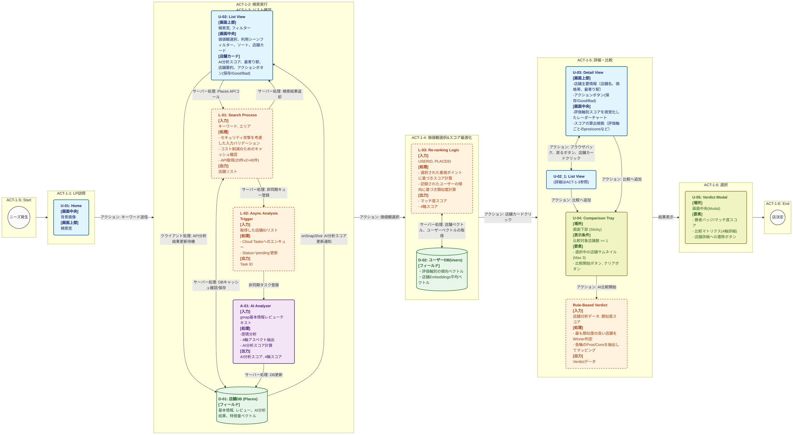
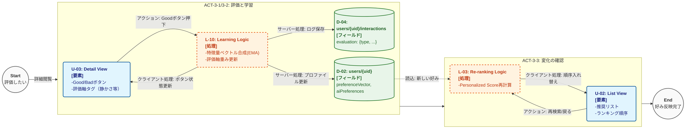
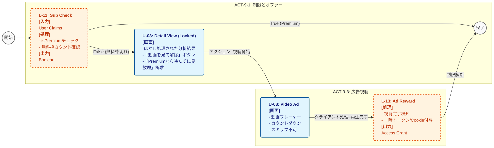

```mermaid
%%{init: {'flowchart': {'useMaxWidth': false, 'rankSpacing': 40, 'nodeSpacing': 20}}}%%
flowchart LR
    %% Definitions
    classDef startend fill:#fafafa,stroke:#666,stroke-width:2px,rx:20,ry:20,color:#333
    classDef ui fill:#e1f5fe,stroke:#01579b,stroke-width:2px,rx:5,ry:5,color:#1a237e,text-align:left
    classDef comp fill:#f0f4c3,stroke:#827717,stroke-width:2px,rx:5,ry:5,color:#33691e,text-align:left
    classDef logic fill:#fff3e0,stroke:#e65100,stroke-width:2px,stroke-dasharray: 5 5,rx:5,ry:5,color:#bf360c,text-align:left
    classDef ai fill:#f3e5f5,stroke:#4a148c,stroke-width:2px,rx:5,ry:5,color:#4a148c,text-align:left
    classDef db fill:#e8f5e9,stroke:#2e7d32,stroke-width:2px,rx:0,ry:0,color:#1b5e20,text-align:left

    S13_Start((開始)):::startend
    S13_End((完了)):::startend

    subgraph ACT_13_1 ["ACT-13-1: 管理画面遷移"]
        direction TB
        U_06_S13["<b>U-06: Profile View</b><br/><b>[画面]</b><br/>- ステータス: Premium<br/>- 「管理」ボタン"]:::ui
        L_14_S13["<b>L-14: Portal Session</b><br/><b>[処理]</b><br/>- Stripe Portal URL発行<br/>- リダイレクト"]:::logic

        U_06_S13 -- "アクション: 管理" --> L_14_S13
    end

    subgraph ACT_13_3 ["ACT-13-3: 外部ポータル"]
        direction TB
        U_Portal["<b>Stripe Portal</b><br/><b>[外部]</b><br/>- プラン変更/解約<br/>- 支払方法変更"]:::comp
        L_12_S13["<b>L-12: Payment Handler</b><br/><b>[処理]</b><br/>- cancel_at_period_end = true<br/>- DB更新"]:::logic
        D_05_S13[("<b>D-05: Customers</b><br/><b>[フィールド]</b><br/>- status: active (維持)<br/>- cancel_at_period_end: true")]:::db

        L_14_S13 -- "Redirect" --> U_Portal
        U_Portal -- "アクション: 解約" --> L_12_S13
        L_12_S13 -. "更新" .-> D_05_S13
    end

    S13_Start --> U_06_S13
    D_05_S13 --> S13_End
```

# 1. プロジェクト仕様書：AI Concierge for グルメ

## 1.1. はじめに
本アプリケーションは、Googleマップの口コミデータをAIを用いて分析し、ユーザーの価値観に合わせて店舗を提案するコンシェルジュアプリケーションです。
この章では、アプリケーションの概要を説明します。

<br>

## 1.2. 技術スタック概要

詳細は [`docs/architecture.md`](./docs/architecture.md) を参照。

*   **Frontend/Backend**: Next.js 14+ (App Router)
*   **Styling**: Tailwind CSS + Lucide React
*   **Database**: Google Cloud Firestore (Cache & Analysis storage)
*   **AI**: Vertex AI (Gemini 2.0 Flash)
*   **Infrastructure**: Google Cloud Run + Cloud Tasks

<br>

## 1.3. マネタイズ戦略
**AARRRモデル** を満たすようシステム機能を設計する。
収益は主に動画広告収入、アフィリエイト、サブスクリプションを想定する。

**参考：AARRRモデル**

ユーザーがサービスを知ってから収益を生むまでのステップを5段階に分解する。どこでユーザーが離脱しているか、どこを改善すれば収益が上がるかを特定するのに最適。
* Acquisition (獲得): ユーザーがサイトやアプリに来る（SEO、SNS）。
* Activation (活性化): ユーザーが初めて価値を感じる（登録、初回利用）。
* Retention (継続): 繰り返し使う。
* Referral (紹介): 他人に勧める。
* Revenue (収益): マネタイズ。 課金や広告閲覧が発生する。

<br>

## 1.4. デザインガイドライン (Design Guidelines)

### 配色設計 (Color Scheme)
ブランドイメージである「高級感」「温かみ」「食欲」を表現するため、以下の配色ルールを厳守する。

**1. Primary Brand Color**
*   **Color Code**: `#E65100` (Material Orange 900)
*   **名称**: Burnt Orange / Brand Orange
*   **用途**:
    *   サイト全体のキーカラー
    *   Primary Action Button (AI比較ボタン等)
    *   強調アイコン (王冠、No.1バッジ)
    *   ヘッダー等のアクセントボーダー
*   `src/app/globals.css` にて `--color-brand` として定義済。


**2. Base Colors**
*   **見出しテキスト**: `#3E3E3E` (淡めの黒)
    *   `src/app/globals.css` にて `--color-brand-black` として定義済。
*   **本文テキスト**: `brand-black/80`
*   **補足テキスト**: `brand-black/50`
*   **枠線**: `brand-gray`
*   **背景**: `brand-gray/10`
    *   純白(`FFFFFF`)のカードを目立たせるため、ベース背景にはごく薄いグレーを使用する。

**3. Functional Colors (Evaluation Axes)**
詳細分析および比較表では、各評価軸を直感的に識別するため固定色を使用する。
*   **味**: `rose-500` (Dish / Rose)
*   **接客**: `pink-500` (Service / Pink) - ハートフルな印象
*   **雰囲気**: `amber-500` (Atmosphere / Amber) - 煌びやかさ
*   **コスパ**: `emerald-500` (Cost / Emerald) - お得感・プラス収支


**4. Implementation Note**
*   Tailwind v4 導入に伴い、`globals.css` での変数定義（`--color-brand` 等）を活用し、ハードコードを減らす方針とする。

<br>
<br>

# 2. 基本設計：ユーザーシナリオ別インタラクションフロー定義

## 2.1. はじめに
この章では、ユーザーシナリオをベースにして、システムのインタラクションフローを定義します。<br/>
 
**インタラクションフローの凡例**
*   青色: User Interface
*   黄緑色: Component
*   赤色: Logic
*   紫色: AI
*   緑色: Database
*   灰色: Start/End


<br>

## 2.3. 設計要素定義 (Design Element Definitions)

各コンポーネントの実装状況と処理内容の定義です。

### User Interface (U-xx)
| ID | 名前 | Status | File / Component | 詳細 (Trigger + IPO) |
| :--- | :--- | :--- | :--- | :--- |
| **U-01** | **Home Hero** | **Implemented** | `src/app/page.tsx`<br>(HomeContent) | **Trigger**: アクセス / ホームリセット<br>**Process**: 背景画像と検索窓(`SearchInput`)を表示。<br>**Output**: ヒーローセクション描画。 |
| **U-02** | **List View** | **Implemented** | `src/app/page.tsx`<br>`src/components/PlaceList.tsx` | **Trigger**: `view=LIST`<br>**Process**: `filteredPlaces`の状態に基づきカードリストを展開。<br>**Output**: 店舗一覧表示。 |
| **U-03** | **Detail View** | **Implemented** | `src/app/page.tsx`<br>`src/components/AnalysisResult.tsx` | **Trigger**: `view=DETAIL`<br>**Process**: レーダーチャート、AI分析バッジ、詳細情報のモーダル的表示。<br>**Output**: 詳細画面。 |
| **U-04** | **Comparison Tray** | **Implemented** | `src/components/ComparisonTray.tsx` | **Trigger**: 複数店舗の選択<br>**Process**: 画面下部に比較候補をストックし表示する。<br>**Output**: 比較トレイUI。 |
| **U-05** | **Verdict Modal** | **Implemented** | `src/components/VerdictModal.tsx` | **Trigger**: 比較実行ボタン<br>**Process**: AI判定結果(Winner/Loser)を表示する。<br>**Output**: 判定モーダル。 |
| **U-06** | **Profile View** | **Implemented** | `src/app/profile/page.tsx` | **Trigger**: `/profile`遷移<br>**Process**: ユーザーの保存/Good/Bad履歴を取得し、タブで切り替え表示。<br>**Output**: マイページ表示。 |
| **U-07** | **Pricing Modal** | <span style="color:red">Pending</span> | - | **Trigger**: プレミアム機能アクセス<br>**Process**: プラン比較表と購入ボタン(Stripe Link)を表示。<br>**Output**: 課金誘導モーダル。 |
| **U-08** | **Video Ad** | <span style="color:red">Pending</span> | - | **Trigger**: 無料制限到達<br>**Process**: 動画広告を再生し、完了までブロックする。<br>**Output**: 動画プレーヤー。 |

### Logic (L-xx)
| ID | 名前 | Status | File / Method | 詳細 (Trigger + IPO) |
| :--- | :--- | :--- | :--- | :--- |
| **L-01** | **Search Process** | **Implemented** | `src/server/actions/place.ts`<br>`searchPlaces` | **Trigger**: 検索実行<br>**Input**: `query` (String)<br>**Process**: Google Places API (20件) 検索。<br>Client側で2回連鎖し計40件取得。<br>**Output**: `PlaceSearchResult[]` |
| **L-02** | **Async Analysis** | **Implemented** | `src/server/actions/place.ts`<br>`enqueueAnalysis` | **Trigger**: 検索/詳細取得時 (Status=pending)<br>**Input**: `placeId`<br>**Process**: Cloud Tasksへ分析タスクをエンキュー。<br>**Output**: Void (Fire-and-forget) |
| **L-03** | **Re-ranking** | **Implemented** | `src/server/actions/personalize.ts`<br>`getPersonalizedScores` | **Trigger**: リスト表示・更新時<br>**Input**: `placeIds`, `uid`<br>**Process**: ユーザー嗜好ベクトルと店舗ベクトルのコサイン類似度計算。Hybridスコア生成。<br>**Output**: `PersonalizedScore[]` |
| **L-06** | **Compare Logic** | **Implemented** | `src/server/actions/comparison.ts`<br>`comparePlaces` | **Trigger**: 比較実行<br>**Input**: `placeIds`, `preference`<br>**Process**: ユーザー嗜好ベクトルと店舗ベクトルのコサイン類似度で勝者を判定。既存の分析データをマトリクス化。<br>**Output**: `ComparisonResult` JSON |
| **L-07** | **Toggle Save** | **Implemented** | `src/server/actions/user.ts`<br>`toggleSavePlace` | **Trigger**: 保存ボタン<br>**Input**: `uid`, `placeId`, `isSaved`<br>**Process**: `users/{uid}/interactions` の `isSaved` フラグを更新。<br>**Output**: Void |
| **L-08** | **Client Filter** | **Implemented** | `src/app/page.tsx`<br>`profile/page.tsx` | **Trigger**: 軸選択/シーン選択/タブ切替<br>**Input**: 店舗リスト, アクティブフィルタ<br>**Process**: メモリ内フィルタリング（利用シーンスコア>=4など）。プロフ画面ではタブ切替。<br>**Output**: Filtered List |
| **L-09** | **Update Status** | <span style="color:red">Pending</span> | `src/server/actions/user.ts` | **Trigger**: 来店済チェック<br>**Input**: `isVisited=true`<br>**Process**: 来店フラグのみを更新する（評価なし）。現状は `submitEvaluation` に包含。<br>**Output**: Void |
| **L-10** | **Learning Logic** | **Implemented** | `src/server/actions/user.ts`<br>`submitEvaluation` | **Trigger**: Good/Bad評価<br>**Input**: `uid`, `placeId`, `type`<br>**Process**: AI選好軸(Linear)と嗜好ベクトル(EMA)を更新。Interaction保存。<br>**Output**: Void |
| **L-11** | **Sub Check** | <span style="color:red">Pending</span> | `hooks/usePremium` | **Trigger**: 機能利用時<br>**Input**: `user.claims` or `subscriptions`<br>**Process**: 有効なサブスクリプションを検証。<br>**Output**: Boolean (IsPremium) |
| **L-12** | **Payment Handler** | <span style="color:red">Pending</span> | `Firebase Extension` | **Trigger**: StripeからのWebhook受信 (決済成功/更新/解約)<br>**Input**: Stripe Event Object (CustID, SubID, Period)<br>**Process**: <br>1. Webhook署名を検証しセキュリティを担保。<br>2. `customer_id` を基にFirestore上のユーザー(`customers/{uid}`)を特定。<br>3. `subscriptions` サブコレクションにステータス(`active`/`canceled`)、有効期限、プラン情報を書き込み/更新する。<br>**Output**: DB Update (`subscriptions` doc)
| **L-13** | **Ad Reward** | <span style="color:red">Pending</span> | - | **Trigger**: 広告視聴完了<br>**Input**: `userId`<br>**Process**: 一時的な機能解放フラグ(Cookie/Session)を付与。<br>**Output**: Access Grant |
| **L-14** | **Portal Session** | <span style="color:red">Pending</span> | `src/server/actions/stripe.ts` | **Trigger**: 管理ボタン<br>**Input**: `uid`<br>**Process**: Stripe APIを呼び出し、カスタマーポータルのワンタイムURLを発行。<br>**Output**: Portal URL |
| **L-15** | **Checkout Session** | <span style="color:red">Pending</span> | `src/server/actions/stripe.ts` | **Trigger**: 購入ボタン<br>**Input**: `priceId`, `uid`<br>**Process**: Stripe Checkout Sessionを作成し、決済及びリダイレクトURLを発行。<br>**Output**: Checkout URL |

### Database (D-xx)
| ID | 名前 | Status | Collection / Path | 概要 |
| :--- | :--- | :--- | :--- | :--- |
| **D-01** | **Places DB** | **Implemented** | `places/{placeId}` | 店舗基本情報＋AI分析結果。 |
| **D-02** | **User Profile** | **Implemented** | `users/{uid}` | ユーザー基本情報＋嗜好ベクトル。 |
| **D-03** | **Analysis** | **Implemented** | `places/{placeId}` | (D-01内包) 感情分析・4軸スコア・特徴量。 |
| **D-04** | **Interactions** | **Implemented** | `users/{uid}/interactions/{placeId}` | ユーザー行動履歴(Save, Good/Bad)と学習ログ。 |
| **D-05** | **Customers** | <span style="color:red">Pending</span> | `customers/{uid}` | Stripe連携用の決済・契約情報。 |

#### Schema Details

**D-01 / D-03: Places Collection (`places/{placeId}`)**
```typescript
interface Place {
  id: string;             // Google Place ID
  name: string;           // 店舗名
  location: { lat: number; lng: number };
  nearestStation?: string;

  // AI Analysis (D-03)
  status: 'pending' | 'processing' | 'completed' | 'error';
  summary?: string;       // AI要約（3行）
  axisScores?: {          // 4軸スコア (0-5)
    taste: number; service: number; atmosphere: number; cost: number;
  };
  usageScores?: {         // シーン適性 (0-5)
    date: number; solo: number; business: number; family: number; group: number;
  };
  embeddingVector?: number[]; // Vertex AI Embedding (768-dim)

  // External Data
  hotpepper?: HotPepperData; // ホットペッパー連携データ
  googleRating: number;
  userRatingsTotal: number;
  priceLevel?: string;    // PRICE_LEVEL_MODERATE etc.
  
  updatedAt: Timestamp;
}
```

**D-02: Users Collection (`users/{uid}`)**
```typescript
interface UserProfile {
  uid: string;
  displayName: string;
  email: string;

  // Personalization Core
  preferenceVector?: number[]; // ユーザーの「好み」を表すベクトル (EMA更新)
  aiPreferences: {             // 4軸の重視度重み (Linear更新)
    taste: number; service: number; atmosphere: number; cost: number;
  };

  // Explicit Settings
  favoriteAreas: string[];     // ["Shinjuku", "Ginza"]
  favoriteGenres: string[];    // ["Sushi", "Italian"]
}
```

**D-04: Interactions Subcollection (`users/{uid}/interactions/{placeId}`)**
```typescript
interface UserInteraction {
  placeId: string;
  uid: string;

  // Flags
  isSaved: boolean;    // 保存状態
  isVisited: boolean;  // 来店記録

  // Evaluation (Learning Log)
  evaluation?: {
    type: 'good' | 'bad';
    timestamp: Timestamp;
    // どの軸/特徴が要因だったか
    selectedFeatureKeys: string[]; 
    axisImpact?: { taste: number; ... }; // Undo用のDelta記録
  };
  updatedAt: Timestamp;
}
```

**D-05: Customers Collection (`customers/{uid}`)**
*Managed by Stripe Firebase Extension*
```typescript
interface Customer {
  stripeId: string;
  stripeLink: string; // Customer Portal Deep Link
  
  // Subcollection: subscriptions/{subId}
  subscriptions: {
    status: 'active' | 'past_due' | 'canceled';
    current_period_end: Timestamp;
    cancel_at_period_end: boolean;
    price: string;    // price_xxxx
    role?: string;    // 'premium' claim
  }[];
}
```

<br/>

## 2.2. ユーザーシナリオ

### シナリオ1: 店舗を手動検索して評価する

#### シナリオ説明
*   **ACT-1-S：Start**: 正確性を求めるユーザー「デート、イベントなどで一番良い店に行きたい。総合星スコアだけでは納得感が得られない。」
*   **ACT-1-1：LP訪問**: ユーザーはトップページを開き、サービスの世界観（「AIコンシェルジュ」）を認知する。
*   **ACT-1-2：検索実行**: 「表参道 イタリアン」「静かな店」などの条件を入力し、検索を実行する。
*   **ACT-1-3：リスト確認**: 検索結果リストが表示される。各カードにはAIが算出した「4軸スコア（味・接客・雰囲気・コスパ）」が表示されている。
*   **ACT-1-4：価値観選択&スコア最適化**: 「今日は雰囲気を重視したい」と考え、フィルター機能で「雰囲気」を優先選択する。リストの並び順とスコアが即座に再計算される。
*   **ACT-1-5：詳細表示**: 気になった店舗をクリックし、詳細分析画面（レーダーチャートや要約）を見る。星評価では得られない深い情報を**簡単かつ瞬時に**得る
*   **ACT-1-6：比較検討**: ブラウザバック、またはナビゲーションでリストに戻り、比較対象の店を見る。
*   **ACT-1-7：選択**: 気になって店舗の中で最もふさわしい店を決定する
*   **ACT-1-E：End**: 「わかりやすく情報が参照できたため、一人で考えるより迅速かつ正確に店選びができた。」

#### インタラクションフロー

<br/>

### シナリオ2: 店舗を保存・検索して、来店後に来店済マーキングをする

#### シナリオ説明
*   **ACT-2-S：Start**: LP検索orSEO流入したユーザー「気になる店が見つかったが、今日は決まらない。後でリストで見返したい。」
*   **ACT-2-1：保存**: ユーザーはリストまたは詳細画面の店舗に対して「保存」ボタンを押下する。
*   **ACT-2-2：確認と検索**: 後日、プロフィール画面の「保存済」タブを開く。保存店舗が増えていたため、「Good/Bad」フィルターや「キーワード検索」を利用して、目的の店（例: 「渋谷 イタリアン」）を素早く絞り込む。
*   **ACT-2-3：来店**: 実際に店舗を訪れる。
*   **ACT-2-4：来店済みチェック**: 食後、プロフィール画面で対象店舗を「来店済み」状態に変更する。
*   **ACT-2-E：End**: 「過去の自分が見つけた良店を埋もれさせず、スムーズに活用できた。」

#### インタラクションフロー


<br/>

```mermaid
%%{init: {'flowchart': {'useMaxWidth': false, 'rankSpacing': 40, 'nodeSpacing': 20}}}%%
flowchart LR
    %% Definitions
    classDef ui fill:#e1f5fe,stroke:#01579b,stroke-width:2px,rx:5,ry:5,color:#1a237e,text-align:left
    classDef comp fill:#f0f4c3,stroke:#827717,stroke-width:2px,rx:5,ry:5,color:#33691e,text-align:left
    classDef logic fill:#fff3e0,stroke:#e65100,stroke-width:2px,stroke-dasharray: 5 5,rx:5,ry:5,color:#bf360c,text-align:left
    classDef ai fill:#f3e5f5,stroke:#4a148c,stroke-width:2px,rx:5,ry:5,color:#4a148c,text-align:left
    classDef db fill:#e8f5e9,stroke:#2e7d32,stroke-width:2px,rx:0,ry:0,color:#1b5e20,text-align:left
    classDef startend fill:#fafafa,stroke:#666,stroke-width:2px,rx:20,ry:20,color:#333

    %% Start/End
    S2_Start(("<b>Start</b><br/>LP検索 or<br/>SEO流入")):::startend
    S2_End(("<b>End</b><br/>活用完了")):::startend

    subgraph ACT_2_1 ["ACT-2-1: 店舗保存"]
        direction TB
        U_02_S2["<b>U-03: Detail View</b><br/><b>U-02: List View</b><br/>詳細はACT-1-2, ACT-1-5参照"]:::ui
        L_07["<b>L-07: Toggle Save</b><br/><b>[処理]</b><br/>- ユーザーIDと店舗IDを紐付け<br/>- Savedリストへ追加/削除"]:::logic
        D_04_S2[("<b>D-04: users/{uid}/interactions</b><br/><b>[フィールド]</b><br/>isSaved, isVisited 等")]:::db
        
        U_02_S2 -- "アクション: 保存ボタン押下" --> L_07
        L_07 -- "サーバー処理: DB更新" --> D_04_S2
        L_07 -- "クライアント処理: 保存ボタン色更新" --> U_02_S2
    end

    subgraph ACT_2_2 ["ACT-2-2: 確認と検索"]
        direction TB
        U_06["<b>U-06: Profile (Saved Tab)</b><br/><b>[画面中央]</b><br/>-保存済み店舗リスト<br/>-フィルター窓（キーワード検索, Good/Bad）<br/><b>[店舗カード]</b><br/>-来店済チェックボタン"]:::ui
        L_08["<b>L-08: Client Filter</b><br/><b>[処理]</b><br/>- タブ切り替え（保存/Good/Bad）<br/>- メモリ内での即時絞り込み"]:::logic
        
        D_04_S2 -. "読込" .-> U_06
        U_06 -- "アクション: '渋谷' + 'Good' 検索" --> L_08
        L_08 -- "クライアント処理: リスト再描画" --> U_06
    end

    subgraph ACT_2_4 ["ACT-2-4: 来店済チェック"]
        direction TB
        L_09["<b>L-09: Update Status</b><br/><b>[処理]</b><br/>- visited: true 更新"]:::logic
        
        U_06 -- "アクション: 来店済チェック" --> L_09
        L_09 -- "クライアント処理: 保存チェックボックス更新" --> U_06
        L_09 -- "サーバー処理: DB更新" --> D_04_S2
    end

    S2_Start -- "詳細閲覧/保存" --> ACT_2_1
    ACT_2_1 --> ACT_2_2
    ACT_2_2 -- "来店" --> ACT_2_4
    ACT_2_4 --> S2_End
```

### シナリオ3: 店舗をグッド/バッドして傾向を学習させる

#### シナリオ説明
*   **ACT-3-S：Start**: 「AIの提案は良かったが、もう少し静かな店が好みだった。」あるいは「ドンピシャだった。」
*   **ACT-3-1：評価**: ユーザーはリストまたは詳細画面の店舗に対して「Good」または「Bad」ボタンを押下する。
*   **ACT-3-2：学習**: システムは即座に以下の計算を実行し、ユーザーの好みベクトルを更新する。
    1.  **特徴量合成**: 対象店舗のEmbedding（特徴ベクトル）を、ユーザーの「好き/嫌い」のポジティブ/ネガティブな重みとして加算する。
    2.  **重視点反映**: ユーザーが検索時に選択していた評価軸（「味」「接客」「雰囲気」「コスパ」）の重みを強化し、次回以降の提案に反映させる。
*   **ACT-3-3：変化**: 検索結果一覧でリアルタイムに、スコアや並び順が微調整され、より好みに近い店が上位に来ていることを感じる。
*   **ACT-3-E：End**: 「使えば使うほど自分色のAIに育っていく感覚を得た。」

#### インタラクションフロー


<br/>

### シナリオ4: AIコンシェルジュチャットボットで「対話的」に最適な店を見つける

#### シナリオ説明
*   **ACT-4-S：Start**: 「検索条件を入れるのが面倒。ざっくりとした相談で決めてほしい。」ユーザーはLPまたはナビゲーションバーから「AIコンシェルジュ」を起動する。
*   **ACT-4-1：ヒアリング**: AIは「コンサルタント」として振る舞い、「デートですか？それとも接待ですか？相手はどんな雰囲気を好みますか？」と、検索条件（What）だけでなく利用背景（Why）を引き出す。
*   **ACT-4-2：実行 (Function Calling)**: 対話内容からパラメータを抽出し、以下のバックエンド機能を自律的に実行する。
    1.  `searchPlaces(keyword, area)`: 広範囲の候補取得。
    2.  `analyzeReviews(ids)`: 候補のAI分析。
    3.  `compareShops(ids, criteria)`: ユーザーの要望（例: 「静かさ重視」）に基づき、候補を比較・フィルタリングする。※ここでの比較はUI上限を超えた数（例: 20件）を処理可能。
*   **ACT-4-3：提案 (Top 3)**: 厳選された3店舗のみを提示する。「A店はここが最高ですが、少し騒がしいかも。B店は静かですが、少し予算オーバーです」といった、比較情報を含めたプレゼンを行う。
*   **ACT-4-4：調整**: ユーザーが「もう少し安いところない？」と返答すると、AIはフィードバックを加味して再度検索・分析ループを実行する。
*   **ACT-4-E：End**: 「会話するだけで、自分で探すよりも納得感のある『正解』に辿り着いた。」

#### インタラクションフロー
*(TBD)*

<br/>

### シナリオ5: [SEO戦略] 「エリア × 利用シーン」特化のランキングで、目的特化型ユーザーを獲得する

#### シナリオ説明
*   **ACT-5-S：Start**: 検索エンジンのクローラー、またはユーザーがトップページを閲覧する。
*   **ACT-5-1：トップレベル認知 (LP)**: 
    *   **ユーザー体験**: ブラウザの基本位置情報を取得し、「現在地（例: 渋谷区）周辺のシーン別ランキング」をタブ切り替えで即座に表示する。
    *   **クローラー対策**: footer等のリンク集から、全エリア・全シーンへの静的リンク網（ディレクトリ）を発見する。
*   **ACT-5-2：構造化 (Directory)**: 
    *   **UX対策 (Filter)**: リンク膨大化に備え、ディレクトリページには「エリア名即時フィルター」を設置し、ユーザーが目的の市区町村に一瞬で到達できるようにする。
    *   **SEO対策 (Hierarchy)**: スパム判定（リンクファーム）を回避するため、全リンクを1ページに羅列せず、「都道府県」→「主要エリア/市区町村」→「利用シーン」といった**階層構造（ピラミッド型）**でページを分割・内部リンクを設計する。これにより、自然なサイト構造として評価させる。
*   **ACT-5-3：詳細インデックス**: 各シーンごとのページには、厳選された店舗リストが掲載されている。
*   **ACT-5-4：評価**: 網羅的かつ専門的なコンテンツとして検索エンジンに高く評価される。
*   **ACT-5-E：End**: 「ニッチな需要（例: 『六本木 接待 隠れ家』）でも検索1位を獲得し、質の高いユーザーを低コストで集客する。」

#### インタラクションフロー
*(TBD)*

<br/>

### シナリオ6: [集客戦略] 地域ごとの月間/週間閲覧ランキングページをSNSに配信して集客する

#### シナリオ説明
*   **ACT-6-S：Start**: 運営チームがSNS（X, Instagram）で定期配信を行う、またはユーザーがシェアする。
*   **ACT-6-1：配信**: 「【渋谷デート】今週、AIスコアが急上昇した隠れ家イタリアンTOP3👑」というフックのあるコピーと共に、生成されたランキングページのURLをシェアする。
*   **ACT-6-2：流入**: SNSユーザーが「自分の知っている店が入っているか」「新しい店はどこか」に興味を持ち、リンクをクリックする。
*   **ACT-6-3：着地**: ランキングの1位〜3位だけをチラ見せし、「4位以下を見る」または「詳細を見る」でLPまたは一覧画面へスムーズに誘導する。
*   **ACT-6-E：End**: 「潜在層が『このアプリなら信頼できそう』と感じ、初回訪問から検索利用へ転換する。」

#### インタラクションフロー
*(TBD)*

<br/>

### シナリオ7: [集客戦略] 店舗を検索して他人にURLを共有する（バイラルループ）

#### シナリオ説明
*   **ACT-7-S：Start**: 「見つけたこの店、パートナーに共有して意見を聞きたい。」
*   **ACT-7-1：共有**: 詳細画面の「シェア」ボタンを押下する。LINEやクリップボードコピーを選択できる。
*   **ACT-7-2：OGP表示**: シェアされたURLには、店舗の「写真」「AI分析による3行要約スコア」がOGP画像としてリッチに表示され、クリック率を高める。
*   **ACT-7-3：閲覧**: 受け取った相手（非会員）は、アプリインストール不要でブラウザですぐに詳細情報（AI分析レポート）を確認できる。
*   **ACT-7-4：連鎖**: 相手も「ここいいね、他にもないかな？」と興味を持ち、そのままサイト内で検索を開始する。
*   **ACT-7-E：End**: 「既存ユーザーが新規ユーザーを連れてくる、自律的な成長サイクル（バイラルループ）が回る。」

#### インタラクションフロー
*(TBD)*

<br/>

### シナリオ8: [マネタイズ戦略] 非会員ユーザーが会員登録を行う（リード獲得）

#### シナリオ説明
*   **ACT-8-S：Start**: 「この店を保存しておきたい。」「もっと自分好みにAIを育てたい。」
*   **ACT-8-1：障壁**: ユーザーが「保存」ボタンや「Good」ボタンを押すと、ログインモーダルが優しく表示される。
*   **ACT-8-2：訴求**: 単なる機能制限ではなく、「ログインすると、あなたの『辛口好み』をAIが学習して、ハズレ店を除外します」というベネフィットを提示する。
*   **ACT-8-3：登録**: Googleログイン（ワンタップ）で登録を完了する。面倒な入力フォームは一切排除する。
*   **ACT-8-4：再開**: 登録完了後、元の画面に戻り、押そうとしていた「保存」アクションが自動で実行完了される（体験を分断しない）。
*   **ACT-8-E：End**: 「ユーザーはストレスなくアクティブ化し、システムは貴重な学習データを獲得する。」

#### インタラクションフロー
*(TBD)*

<br/>

### シナリオ9: [マネタイズ戦略] 無課金ユーザーが動画広告を閲覧して機能を解放する
#### シナリオ説明
*   **ACT-9-S：Start**: 「詳しく見たいが、今日の無料枠を使い切ってしまった。」
*   **ACT-9-1：制限**: 詳細情報の重要な部分（AIディープ分析）にぼかしが入り、「動画を見て続きを見る」ボタンが表示される。
*   **ACT-9-2：選択**: ユーザーは「課金するほどではないが、この店だけはどうしても知りたい」と考え、広告視聴を選択する。
*   **ACT-9-3：視聴**: 15〜30秒の動画広告を視聴完了する。
*   **ACT-9-4：報酬**: 対象店舗の分析レポートが即座に解放され、閲覧可能になる。有料会員は**このプロセスを自動スキップ**する。
*   **ACT-9-E：End**: 「ユーザーにとっては『実質無料』、運営にとっては『広告収益』というWin-Winの関係が成立する。」

#### インタラクションフロー


<br/>

### シナリオ10: [マネタイズ戦略] ヘビーユーザーがサブスクリプションを購入する
#### シナリオ説明
*   **ACT-10-S：Start**: 「広告が煩わしい。」「制限を気にせず、全エリアのAIコンシェルジュを使い倒したい。」
*   **ACT-10-1：オファー**: 検索画面やマイページに「Premiumプラン: 月額500円」のバナーが表示される。特に「AIコンシェルジュ無制限」「広告非表示」が強調される。
*   **ACT-10-2：検討**: LPにて、無料プランとの比較表を見る。「月1回のランチ代で、一生の店選び失敗を防げます」というコピーに納得する。
*   **ACT-10-3：購入**: Stripe決済などでクレジットカード登録を行い、Premium会員になる。
*   **ACT-10-E：End**: 「ストレスフリーな最高級の探索体験を手に入れ、アプリが手放せないツールになる。」

#### インタラクションフロー


<br/>

```mermaid
%%{init: {'flowchart': {'useMaxWidth': false, 'rankSpacing': 40, 'nodeSpacing': 20}}}%%
flowchart LR
    %% Definitions
    classDef startend fill:#fafafa,stroke:#666,stroke-width:2px,rx:20,ry:20,color:#333
    classDef ui fill:#e1f5fe,stroke:#01579b,stroke-width:2px,rx:5,ry:5,color:#1a237e,text-align:left
    classDef comp fill:#f0f4c3,stroke:#827717,stroke-width:2px,rx:5,ry:5,color:#33691e,text-align:left
    classDef logic fill:#fff3e0,stroke:#e65100,stroke-width:2px,stroke-dasharray: 5 5,rx:5,ry:5,color:#bf360c,text-align:left
    classDef ai fill:#f3e5f5,stroke:#4a148c,stroke-width:2px,rx:5,ry:5,color:#4a148c,text-align:left
    classDef db fill:#e8f5e9,stroke:#2e7d32,stroke-width:2px,rx:0,ry:0,color:#1b5e20,text-align:left

    S10_Start((開始)):::startend
    S10_End((完了)):::startend
    
    subgraph ACT_10_2 ["ACT-10-2: プラン検討"]
        direction TB
        U_07_S10["<b>U-07: Pricing Modal</b><br/><b>[画面]</b><br/>- Free vs Premium比較表<br/>- 動画広告スキップ訴求<br/>- 月額500円ボタン"]:::ui
    end

    subgraph ACT_10_3 ["ACT-10-3: 決済 (Stripe)"]
        direction TB
        L_15_S10["<b>L-15: Checkout Session</b><br/><b>[処理]</b><br/>- Checkout Session作成<br/>- URL発行"]:::logic
        U_Stripe["<b>Stripe Checkout</b><br/><b>[外部]</b><br/>- クレジットカード入力<br/>- サブスクリプション確定"]:::comp
        L_12_S10["<b>L-12: Payment Handler</b><br/><b>[処理]</b><br/>- Webhook受信<br/>- customers/{uid}/subscriptions 更新"]:::logic
        D_05_S10[("<b>D-05: Customers</b><br/><b>[フィールド]</b><br/>- stripeId<br/>- status: 'active'<br/>- current_period_end")]:::db

        U_07_S10 -- "アクション: 購入" --> L_15_S10
        L_15_S10 -- "Redirect" --> U_Stripe
        U_Stripe -- "WebHook" --> L_12_S10
        L_12_S10 -. "更新" .-> D_05_S10
    end

    S10_Start --> U_07_S10
    D_05_S10 -- "同期完了" --> S10_End
```

### シナリオ11: [マネタイズ戦略] サブスクリプションを継続させる（チャーン防止）

#### シナリオ説明
*   **ACT-11-S：Start**: 月末または更新時期が近づく。
*   **ACT-11-1：成果報告**: 月次レポートメールが届く。「今月、AIはあなたのために 120件 の店を除外し、 3件 の最高の提案をしました。」
*   **ACT-11-2：再発見**: 「先週末に行ったあの店、あなたの好みに完璧にマッチしていましたね」という振り返りにより、サービスの価値を再認識する。
*   **ACT-11-3：継続**: 「解約したらまた店選びで迷うことになる」と感じ、継続（自動更新）を選択する。
*   **ACT-11-E：End**: 「LTV（顧客生涯価値）が最大化され、安定した収益基盤となる。」

#### インタラクションフロー
*(TBD)*

<br/>

### シナリオ12: [マネタイズ戦略] 詳細画面から予約して成果報酬を得る（送客手数料）

#### シナリオ説明
*   **ACT-12-S：Start**: 「AI分析を見て、この店に行くことに決めた。今すぐ席を押さえたい。」
*   **ACT-12-1：予約導線**: 詳細画面の目立つ位置に「空席確認・予約（HotPepper / 一休 / 食べログ）」ボタンを配置する。
*   **ACT-12-2：遷移**: ユーザーがボタンを押すと、アフィリエイトパラメータ付きのURLを経由して、各予約サイトの対象店舗ページへ遷移する。
*   **ACT-12-3：完了**: ユーザーが予約を完了し、後日来店する。
*   **ACT-12-4：確定**: ASP（アフィリエイト・サービス・プロバイダ）から成果が承認され、報酬が発生する。
*   **ACT-12-E：End**: 「ユーザーはスムーズに予約でき、運営は『送客』という価値に対して正当な対価を得る。」

#### インタラクションフロー
*(TBD)*
<br/>

### シナリオ13: [マネタイズ戦略] ユーザーがサブスクリプションを解約する
#### シナリオ説明
*   **ACT-13-S：Start**: 「とりあえず今月だけ使おうと思っていた。」「生活環境が変わり、外食が減った。」
*   **ACT-13-1：設定**: プロフィール画面の「サブスクリプション管理」ボタンを押下する。
*   **ACT-13-2：ポータル**: セキュリティのため、アプリ内ではなく Stripeがホストする「カスタマーポータル」へ安全に遷移する。
*   **ACT-13-3：解約**: ユーザーはポータル上で「プランをキャンセル」を選択する。引き止め（アンケート等）があるかもしれないが、最終的に解約を確定する。
*   **ACT-13-4：反映**: 即座に解約されるわけではなく、「現在の請求期間の末日」までは利用可能(Active)な状態が維持される。
*   **ACT-13-E：End**: 「期間終了後、自動的に無料プランへ移行する。意図しない課金が継続することはなく、ユーザーの信頼は保たれる。」

#### インタラクションフロー

<br/>